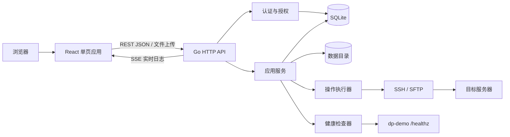
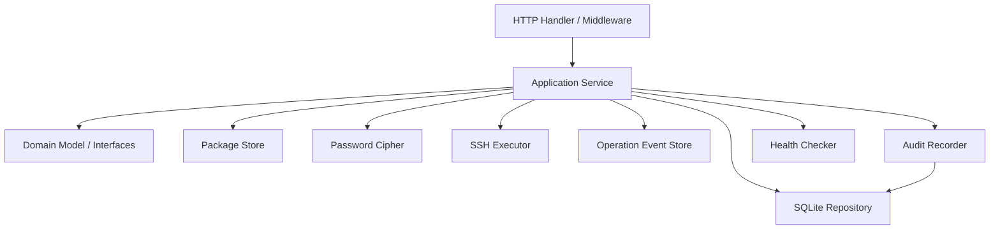
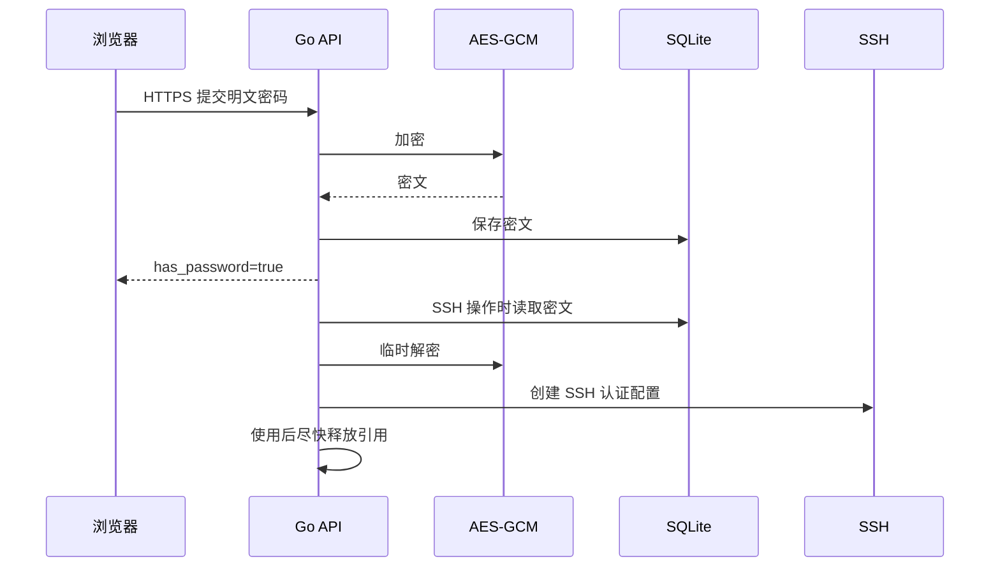
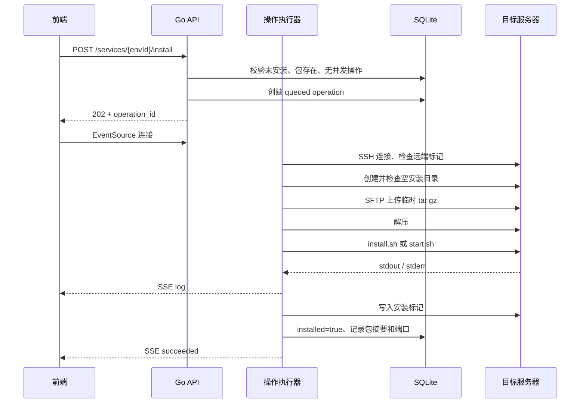

# DP 前后端架构设计

> 文档状态：初版
> 依据：[PRD](./prd.md)
> 路线图：[管理员产品优化路线图](./admin-product-optimization.md)
> 更新时间：2026-08-30

## 1. 设计目标

DP 是一个使用本地账号登录的内部 Web 管理后台。系统按账号隔离安装包、目标服务器环境和模型，通过
SSH/SFTP 执行服务生命周期操作及模型传输；同时提供配置编辑、健康检查、环境迁移和实时执行日志。
管理员可管理账号并查看、操作全部账号的数据，普通账号只能访问自己的数据。

本设计优先考虑：

- 单机部署简单：一个 Go 进程、一个 SQLite 数据库、一个数据目录。
- 密码安全：SSH 密码始终密文落盘，仅在后端实际连接时短暂解密。
- 权限可靠：认证、角色判断和数据归属校验全部在后端完成，前端只负责呈现可用入口。
- 操作可观察：浏览器关闭或 SSE 重连后仍可查看操作进度和结果。
- 文件操作可靠：安装包上传采用临时文件加原子替换；远端实例配置采用临时文件加原子替换。
- 易于扩展：上传安装包时可创建自定义服务类型，通用包约定保持一致。
- 避免过度设计：第一版不拆微服务，不引入消息队列、Redis 或独立数据库服务。

## 2. 总体架构



采用“模块化单体”：

- 前端构建为静态文件，通过 Go `embed` 嵌入并由同一进程提供。
- 浏览器与 API 同源，不开放 CORS。
- SQLite 保存账号、登录会话、环境、安装包元数据、安装状态、操作记录和审计事件。
- 文件系统保存不可变安装包版本，`storage_path` 是文件位置的唯一依据；操作日志通过环境归属间接关联账号。
- Go 进程直接执行 SSH、SFTP、压缩包处理和健康检查。

第一版只支持单实例运行。多个 DP 实例不得同时读写同一个 SQLite 文件或数据目录。

## 3. 技术选型

### 3.1 前端

| 类别 | 选型 | 说明 |
| --- | --- | --- |
| UI 框架 | React 19 + TypeScript | 组件模型成熟，适合表格、表单、弹窗和异步状态较多的后台 |
| 构建工具 | Vite | 无需 SSR，开发启动和构建简单，官方提供 React/TypeScript 模板 |
| 组件库 | Ant Design 6 | 面向企业后台，现成提供表格、表单、上传、抽屉、弹窗、状态反馈 |
| 服务端状态 | TanStack Query | 统一处理请求、缓存、轮询、失效刷新和 mutation 状态 |
| 路由 | React Router | 管理多角色业务页面和兜底跳转，不使用重量级全栈框架 |
| 配置编辑器 | Monaco Editor | 提供 JSON/YAML 高亮、格式化和错误标记体验 |
| 实时日志 | 浏览器原生 `EventSource` | 日志为服务端到浏览器的单向流，SSE 比 WebSocket 更简单 |
| 测试 | Vitest + React Testing Library | 覆盖组件、客户端契约与关键交互 |

版本策略：

- 使用实施时相互兼容的稳定版本，主版本按上表控制。
- 使用 `pnpm-lock.yaml` 锁定全部准确版本。
- Vite 只转译 TypeScript，CI 额外运行 `tsc --noEmit` 做类型检查。

不选择 Next.js：本系统不需要 SEO、SSR、服务端 React 或边缘渲染，引入全栈框架会形成第二个服务端边界。

### 3.2 后端

| 类别 | 选型 | 说明 |
| --- | --- | --- |
| 语言 | Go 1.26 | 与当前 `go.mod` 一致 |
| HTTP | 标准库 `net/http`、`ServeMux` | 已支持方法和路径参数，当前 API 规模无需额外 Web 框架 |
| 数据访问 | `database/sql` + 显式 SQL | 表少、查询明确，便于控制事务和冲突覆盖 |
| 数据库 | SQLite，WAL 模式 | 单机低写并发后台，无需额外数据库服务 |
| SQLite 驱动 | `modernc.org/sqlite` | 纯 Go，便于生成无 CGO 的单文件程序 |
| 数据迁移 | 内嵌版本化 SQL migration | 启动时先迁移，再启动 HTTP 服务 |
| SSH | `golang.org/x/crypto/ssh` | Go 官方扩展仓库的 SSH 客户端实现 |
| 文件上传 | `github.com/pkg/sftp` | 复用 SSH 连接上传安装包及执行写权限探测 |
| 加密 | 标准库 AES-256-GCM | 同时提供加密和完整性校验，密文可跨后台迁移 |
| 登录密码 | `bcrypt` | 只保存不可逆密码哈希，不复用 SSH 密码加密机制 |
| 会话 | 随机不透明 Token + SQLite | 浏览器只保存 HttpOnly Cookie，数据库只保存 Token 的 SHA-256 摘要 |
| YAML 解析 | `go.yaml.in/yaml/v3` | 后端解析并校验 `config/config.yaml` |
| 日志 | `log/slog` | 输出结构化日志，并统一做敏感字段过滤 |
| API 契约 | OpenAPI 3.1 | 前后端共享接口模型，前端生成 TypeScript 类型 |
| 测试 | `testing`、`httptest`、`go test -race` | 标准工具覆盖单元、接口、集成和并发测试 |

## 4. 前端架构

### 4.1 页面与导航

后台采用桌面优先布局，建议最小宽度 1024px，主导航包含：

0. **登录与个人账号**
   - 用户名和密码登录、退出
   - 当前账号查看和修改本人密码

1. **安装包管理**
   - 选择已有服务类型或输入自定义类型
   - 当前安装包列表与上传、更新、删除入口
   - 以独立列展示所属账号，并展示文件摘要、备注、模板端口和更新时间
   - 按服务类型检索，分页展示（默认每页 10 条）
2. **环境管理**
   - 环境列表，以独立列展示所属账号
   - 新建、编辑、删除环境
   - 按 IP 或服务类型检索，分页展示（默认每页 10 条）
   - 一键 SSH 校验
   - JSON 导入、导出
3. **模型管理**
   - 选择已有环境，复用 SSH 凭据把模型部署到目标绝对目录
   - 第一阶段支持超大 `.tar.gz` 分片续传、远端安全解压、日志、重试和删除
   - 第二阶段支持 ModelScope 和 Hugging Face，默认 ModelScope
4. **服务管理**
   - 按 IP 或服务类型检索
   - 以独立列展示所属账号及各环境上的服务状态
   - 按服务器维护独立配置
   - 安装、启动、停止、重置操作
5. **账号管理（仅管理员）**
   - 新增账号、重置密码、启用或禁用、删除
   - 有业务数据的账号禁止删除
6. **审计日志（仅管理员）**
   - 查看全部账号的认证、账号管理和资源操作轨迹
   - 按时间、账号、资源所属账号、事件、结果和来源 IP 筛选
   - 查看脱敏详情，并按当前筛选条件导出 CSV
7. **管理总览（仅管理员）**
   - 系统规模、运行健康、失败操作、当前管理员未读通讯和风险通知聚合
   - 待处理事项按通讯消息与风险通知分区，分别跳转到对应通讯事项或带筛选条件的管理页面
8. **操作中心（仅管理员）**
   - 全账号操作筛选、状态跟踪、失败处置和历史日志回看
9. **通知中心（仅管理员）**
   - 风险事件未读提醒、详情跳转和处理确认
10. **消息中心（全部账号）**
   - 管理员与普通账号之间的协作事项、未读消息和回执
   - 作为侧边栏一级入口，同时保留顶栏快捷提醒入口

管理员在安装包、环境、模型和服务页面使用统一的“数据范围”筛选器。默认展示全部账号；新建资源在
表单中显式选择所属账号并默认当前管理员，编辑或操作其他账号资源时保持原归属。普通账号不显示数据
范围筛选器和管理员入口。

#### 登录页视觉规范

- 登录页沿用全局靛青品牌色、分层中性色和半透明材质，不采用与产品脱节的通用居中白卡片。
- 桌面端采用左右分区：左侧为品牌与产品能力区，右侧为登录表单区；整体内容设置最大宽度，在超宽屏上保持足够视觉体量和均衡留白。
- 品牌区展示 DP Console 标识、部署管理定位，以及安装包、服务器环境、凭据安全三项核心能力；装饰图形只用于建立空间层次，不影响信息阅读。
- 登录表单使用“欢迎回来”作为任务标题，输入框提供明确占位提示，主按钮延续全局品牌色；底部提示会话与凭据安全边界。
- 登录错误继续使用全局消息反馈；提交期间按钮显示加载状态，避免重复登录。
- 在较窄桌面窗口中压缩品牌区并保持表单完整可用；当前产品仍以最小宽度 960px 为桌面使用边界。

删除环境和删除安装包均已提供入口，处理规则见 4.2、8.4 和 12 节：已安装服务的环境、有操作执行中的环境、以及仍存在已安装环境的服务类型安装包不允许删除。

### 4.2 核心交互

#### 安装包管理页

- 顶部提供按服务类型检索的搜索框（本地过滤，不区分大小写），列表分页展示，默认每页 10 条。
- 每行提供“更新”和“删除”入口；删除前弹窗二次确认。
- 表格在“当前安装包”右侧展示“备注”列：内容超长时省略号截断（不撑大表格），鼠标悬浮显示全文，无备注显示 `-`。
- 列表使用固定表格布局和明确的最小横向宽度。当前安装包列保留足够空间，文件名单行省略并通过 Tooltip 展示全文，SHA-256 截断摘要使用等宽字体；窄窗口由表格容器横向滚动，不允许文件名换行撑高整行或操作按钮被裁切。
- 行操作统一使用紧凑按钮和不换行容器，保持“版本 → 更新 → 删除”的固定顺序，危险操作继续使用红色语义与二次确认。
- 上传与更新共用一个弹窗，底部提供可选备注输入（最多 200 字，带字数统计）：
  - 上传新类型时必须选择安装包文件，备注可选。
  - 更新已有类型时安装包文件与备注均可选但至少变更其一：未选择文件保留当前安装包（此时允许仅更新备注），未传备注字段保留原有备注；传空备注表示清空。
  - 仅更新备注不改动包文件及上传/更新时间。
- 该服务类型下存在已安装环境时，后端返回 409 `PACKAGE_IN_USE`，前端展示错误信息，不删除。

#### 环境管理页

- 表格列：环境名称、IP、架构（`uname -m` 采集，未采集显示 `-`）、SSH 用户、SSH 端口、备注、安装目录、服务类型、SSH 校验状态、更新时间、操作。备注列位于“服务器”列右侧，超长截断、鼠标悬浮显示全文，无备注显示 `-`。
- 顶部提供搜索框，同时匹配 IP 和服务类型（本地过滤，不区分大小写）；列表分页展示，默认每页 10 条。
- 操作列提供“删除”，弹窗二次确认；已安装服务的环境禁用删除并提示先重置，后端对仍发起删除的请求返回 409 `ENVIRONMENT_INSTALLED`。
- 新建/编辑使用右侧抽屉，避免离开列表上下文；抽屉底部提供可选备注输入（最多 200 字，带字数统计），编辑时自动带出当前备注，留空保存即清空。
- 新建默认值：
  - SSH 用户：`aaron`
  - SSH 端口：`22`
  - 服务类型：从已上传安装包对应的类型中选择
- 编辑时后端只返回 `has_password: true/false`，绝不返回密码或密文。
- 密码框留空代表“保持原密码”，输入新值代表替换。
- SSH 校验逐项展示：连接、创建目录、上传测试文件；失败时标记具体阶段。
- 导入为 `.json` 文件上传。校验或解密失败时整批不写入；成功后展示新增数和覆盖数。
- 导出直接下载带版本号的 JSON 文件，例如 `dp-environments-20260728.json`。

#### 模型管理页

- 作为“环境管理”下方的一级页面，列表展示模型名称、来源、所属账号、目标环境/IP/目录、大小、状态、
  进度、创建人和时间。
- 第一阶段新建表单只开放“离线上传”，选择已有环境、模型名称、目标绝对目录和 `.tar.gz` 文件。
- 浏览器按服务端 offset 顺序上传分片，刷新后查询 offset 并继续；页面显示本地上传和远端部署两个阶段。
- 行操作提供继续上传、查看任务日志、重试部署和删除。删除要求输入模型名称二次确认并提示先停止引用
  模型目录的服务。
- 在线下载入口标记为后续功能；第二阶段默认 ModelScope，并允许切换 Hugging Face。
- 详细交互和安全边界见[模型管理需求与设计](./model-management.md)。

#### 服务管理页

服务表格按环境展示：

- 服务类型、环境名称、IP、是否已安装、运行状态、上次检查时间。
- 部署状态依据 `installed` 与该环境最近一次操作（`GET /services` 返回的 `last_operation`）共同展示：`installed=true` 显示“已安装”；否则最近一次操作为安装且状态为失败/超时/中断时显示“安装失败”（红色，鼠标提示失败原因），其余情况显示“未安装”；重置成功后最近一次操作为重置，恢复“未安装”。
- 顶部提供搜索框，同时匹配 IP 和服务类型（本地过滤，不区分大小写）；列表分页展示，默认每页 10 条。
- 状态显示：
  - `运行中`：绿色。
  - 非运行中：按 PRD 显示 `-`，鼠标提示内部原因。
  - `检查中`：加载状态。
- 未上传有效安装包时禁用“配置”和“安装”。
- “配置”读取并保存当前环境的独立配置；首次编辑时使用安装包配置作为模板。
- 安装成功后永久禁用“安装”，并提示安装时间。
- 未安装时禁用“启动”和“停止”。
- “重置”按钮无论是否安装成功均展示：安装失败后远端服务可能仍在反复重启，用户可借此强制停止远端服务并清理安装标记；未安装时确认弹窗需说明这一语义。
- 同一环境有操作执行中时，禁用该环境的其他操作，防止并发冲突。

#### JSON/YAML 配置编辑

- 使用全屏或大尺寸弹窗承载 Monaco Editor。
- 后端返回配置文件路径和格式，编辑器据此启用 JSON 或 YAML 语法高亮。
- JSON 在前端保存前执行 `JSON.parse`；YAML 由后端进行权威格式校验。
- 无论前端是否已校验，后端都必须再次按实际格式解析配置。
- 保存接口提交原始字符串，以保留用户缩进格式。
- 后端返回具体错误位置时，在 Monaco 中创建错误标记并定位。
- 保存未安装实例配置时只更新实例配置记录。
- 保存已安装实例配置时，通过 SSH 原子替换远端配置文件并更新健康检查端口。
- 任一实例保存配置均不得改变公共安装包或其他实例配置。

#### 操作结果弹窗

点击安装、启动、停止后：

1. 前端 `POST` 创建操作，后端返回 `202` 和 `operation_id`。
2. 立即打开弹窗，并连接 `/operations/{id}/events`。
3. 弹窗按时间追加 `stdout`、`stderr` 和系统阶段日志。
4. 展示当前阶段、已运行时间和最终状态。
5. 弹窗可以关闭，关闭不会取消远端操作。
6. 再次打开操作时，从上次序号继续拉取；页面刷新后也能恢复。
7. 终态包括：成功、失败、超时、服务重启导致中断。

日志必须以文本节点渲染，禁止使用 `dangerouslySetInnerHTML`，避免远端脚本输出造成 XSS。

#### 审计日志页

- 审计日志使用独立路由 `/audit`，仅管理员菜单可见；路由与 API 都执行角色校验，前端隐藏菜单不作为权限边界。
- 顶部统计卡展示当前范围内的总事件、失败、登录失败和高风险事件；筛选区采用服务端查询，不加载全量数据到浏览器后过滤。
- 表格使用按 `(occurred_at, id)` 排序的游标分页，避免审计记录持续写入时页码漂移；默认最近 24 小时、每页 50 条。
- 操作账号与资源所属账号分开显示。例如管理员修改普通账号的环境时，前者是管理员，后者是普通账号。
- 事件详情抽屉展示请求 ID、关联操作 ID、目标快照和经过字段白名单过滤的变更摘要。密码、密文、Token、Cookie、配置正文、包内容和远程输出永不下发。
- CSV 导出沿用当前筛选条件，设置 `Cache-Control: no-store` 和附件下载响应；导出请求本身写入审计日志，但普通列表查询不逐次审计。

### 4.3 前端状态分层

- TanStack Query 管理环境、包信息、服务状态、操作状态等服务端数据。
- 表单值、弹窗开关、当前日志滚动位置使用组件本地状态。
- 不引入 Redux/Zustand；第一版没有需要全局同步的复杂客户端业务状态。
- 推荐 Query Key：

```text
['environments']
['service-types']
['package', serviceType]
['services', serviceType]
['operation', operationId]
```

服务状态每 10 秒刷新一次；页面不可见时暂停轮询，恢复可见时立即刷新。操作执行期间，SSE 负责实时状态，不对该操作高频轮询。

### 4.4 前端目录建议

```text
web/
├── src/
│   ├── app/                  # 路由、Provider、全局错误边界
│   ├── api/                  # HTTP Client 与接口访问封装
│   ├── components/           # 通用组件
│   ├── features/
│   │   ├── environments/     # 环境列表、表单、导入导出
│   │   ├── packages/         # 上传、配置编辑
│   │   ├── services/         # 服务列表和健康状态
│   │   └── operations/       # 实时日志弹窗和 SSE
│   ├── pages/
│   ├── styles/
│   └── main.tsx
├── tests/
├── index.html
├── package.json
├── pnpm-lock.yaml
└── vite.config.ts
```

## 5. 后端架构

### 5.1 分层



- **HTTP 层**：解析请求、校验基本格式、调用应用服务、序列化响应和 SSE。
- **应用层**：环境导入、安装、启动、停止等用例及事务边界。
- **领域层**：环境、安装包、操作、服务类型等模型和规则，不依赖 HTTP/SQLite。
- **基础设施层**：SQLite、文件系统、加密、SSH/SFTP、健康检查和事件存储。

不要建立纯粹为“分层”而存在的接口。只在需要替换实现或隔离外部系统的边界定义接口，例如 `EnvironmentRepository`、`SSHClient`、`PackageStore`、`PasswordCipher`。

### 5.2 后端目录建议

```text
cmd/dp/
└── main.go
internal/
├── config/                   # 环境变量加载与启动校验
├── domain/                   # 领域模型、状态枚举、错误
├── application/              # 用例编排
├── httpapi/                  # Handler、中间件、SSE、静态文件
├── repository/sqlite/        # SQL Repository
├── security/                 # AES-GCM、脱敏、Origin 校验
├── archive/                  # tar.gz 校验与配置模板读取
├── packagefs/                # 安装包原子存储
├── remote/                   # SSH/SFTP、命令转义、远端脚本
├── operation/                # 操作调度、环境锁、事件中心
├── audit/                    # 审计事件、脱敏、查询与导出
└── health/                   # 周期健康检查
migrations/                   # 内嵌 SQL
api/
└── openapi.yaml
web/                          # 前端工程
docs/
data/                         # 运行时生成，不提交 Git
```

### 5.3 服务类型扩展机制

服务类型直接使用 `packages.service_type` 标识，不额外建立重复的类型注册表。服务类型位于账号命名空间内，以 `(owner_id, service_type)` 唯一；上传新类型的首个安装包即为当前账号创建该类型，环境只能选择同一所属账号已有安装包对应的类型。所有类型共享以下轻量包约定：

- 包根目录必须存在且只能存在 `config/config.json`、`config/config.yaml`、`config/application.yml` 或 `config/application.yaml` 其中之一。
- 允许所有内容统一放在一个公共顶层目录中；适配器记录该目录，远端解压时使用 `--strip-components=1` 剥离。
- 使用公共顶层目录时不允许混入该目录之外的其他文件。
- 多个候选配置文件同时存在时拒绝安装包，避免配置来源不明确。
- 若 `start.sh` 中显式出现另一个配置格式的路径，上传阶段直接拒绝并返回可操作的错误。
- `start.sh` 和 `stop.sh` 必须存在。
- `install.sh` 可选，存在时安装优先使用它。
- JSON/YAML 中的顶层 `port` 或 `server.port` 必须能解析为 `1–65535` 的端口号，顶层 `port` 优先。
- 健康地址为 `http://<IP>:<port>/healthz`。

如果未来某类服务需要不同的脚本或健康协议，再针对该差异引入策略接口；当前不预先建立空适配器层。

## 6. 数据设计

### 6.1 `users`

| 字段 | 类型 | 说明 |
| --- | --- | --- |
| `id` | TEXT PK | UUID |
| `username` | TEXT UNIQUE | 登录名，规范化后唯一 |
| `password_hash` | TEXT | bcrypt 密码哈希 |
| `role` | TEXT | `admin` 或 `user` |
| `enabled` | INTEGER | 是否允许登录和继续使用已有会话 |
| `must_change_password` | INTEGER | 是否使用初始化、账号创建或管理员重置产生的临时密码；为真时限制为仅可查询本人、修改本人密码和退出 |
| `is_initial_admin` | INTEGER | 是否为首次启动创建且受保护的管理员 |
| `created_by` | TEXT | 创建该账号的管理员 ID；初始管理员为空 |
| `created_at` | TEXT | 创建时间 |
| `updated_at` | TEXT | 更新时间 |

用户名长度为 3–32，只允许字母、数字、点、下划线和连字符，并以字母或数字开头；密码长度为 8–128。用户名按小写规范化，避免大小写相似账号。

### 6.2 `sessions`

| 字段 | 类型 | 说明 |
| --- | --- | --- |
| `token_hash` | TEXT PK | 随机会话 Token 的 SHA-256 摘要 |
| `id` | TEXT UNIQUE | 对外展示和撤销使用的随机会话 ID，不用于认证 |
| `user_id` | TEXT FK | 登录账号 |
| `source_ip` | TEXT | 登录时按可信代理规则解析的来源 IP |
| `user_agent` | TEXT | 登录时截断保存的客户端摘要，最长 512 字符 |
| `last_seen_at` | TEXT | 最近活动时间，认证请求至多每 5 分钟刷新一次 |
| `expires_at` | TEXT | 固定过期时间 |
| `created_at` | TEXT | 创建时间 |

浏览器 Cookie 中保存 32 字节随机 Token，SQLite 只保存摘要；API 只返回独立会话 ID，不返回 Token 摘要。Cookie 使用 `HttpOnly`、`SameSite=Strict` 和 `/` 路径；HTTPS 请求附加 `Secure`。会话默认有效期 24 小时。登录时清理过期会话；退出、改密、重置密码或禁用账号时删除相应会话。认证上下文同时携带用户和会话 ID，用于识别当前会话及精确撤销。

#### 6.2.1 `login_throttles`

| 字段 | 类型 | 说明 |
| --- | --- | --- |
| `scope_key` | TEXT PK | `username:<规范化用户名>` 或 `ip:<来源 IP>` |
| `failure_count` | INTEGER | 当前 10 分钟窗口内失败次数 |
| `window_started_at` | TEXT | 当前统计窗口开始时间 |
| `blocked_until` | TEXT | 当前退避截止时间 |
| `updated_at` | TEXT | 最近更新，用于清理过期状态 |

登录前先同时检查用户名和来源 IP 两个键，任一键仍在退避期即返回统一的 `LOGIN_THROTTLED`。失败后在 SQLite 事务内更新两个键，第 5 次起按 `30s × 2^(失败次数-5)` 退避并封顶 15 分钟；成功后删除两个键。状态持久化避免应用重启绕过限流，超过 24 小时未更新的状态由后台任务清理。同一用户名和来源 IP 的限流拒绝在 30 秒内聚合为一条审计，避免攻击流量反向放大审计表。

### 6.3 `environments`

| 字段 | 类型 | 说明 |
| --- | --- | --- |
| `id` | TEXT PK | UUID |
| `owner_id` | TEXT FK | 所属账号 |
| `name` | TEXT | 环境名称 |
| `ip` | TEXT | 规范化后的 IPv4/IPv6 |
| `ssh_user` | TEXT | SSH 用户 |
| `ssh_port` | INTEGER | 1–65535 |
| `ssh_password_enc` | TEXT | `enc:v1:<base64>` 密文 |
| `install_dir` | TEXT | 远端绝对路径 |
| `service_type` | TEXT | 动态服务类型标识 |
| `note` | TEXT | 可选备注，最长 200 字符，无备注为空串 |
| `installed` | INTEGER | 是否安装成功 |
| `installed_at` | TEXT NULL | RFC 3339 UTC 时间 |
| `installed_package_sha256` | TEXT NULL | 实际安装的包版本 |
| `health_port` | INTEGER NULL | 安装时从配置提取的端口 |
| `host_key_fingerprint` | TEXT NULL | 首次信任的 SSH 主机指纹 |
| `arch` | TEXT | 服务器架构，SSH 执行 `uname -m` 采集（TrimSpace），未采集为空串 |
| `last_validation_at` | TEXT NULL | 最近 SSH 校验时间 |
| `created_at` | TEXT | 创建时间 |
| `updated_at` | TEXT | 更新时间 |

唯一索引：

```sql
UNIQUE(owner_id, ip, service_type)
```

`installed` 是安装操作成功后的持久化结果，不根据健康检查反推。服务停止或健康检查失败不代表“未安装”。

### 6.4 `packages`

| 字段 | 类型 | 说明 |
| --- | --- | --- |
| `owner_id` | TEXT PK/FK | 所属账号 |
| `service_type` | TEXT PK | 账号内的服务类型 |
| `current_version_id` | TEXT FK | 当前版本 ID |
| `original_filename` | TEXT | 当前版本上传文件名快照 |
| `storage_path` | TEXT | 当前版本相对路径快照 |
| `sha256` | TEXT | 当前版本摘要快照 |
| `size_bytes` | INTEGER | 当前版本文件大小快照 |
| `config_port` | INTEGER | 当前版本配置模板默认端口快照 |
| `note` | TEXT | 当前版本备注快照 |
| `uploaded_at` | TEXT | 当前版本上传时间快照 |
| `updated_at` | TEXT | 当前指针或备注更新时间 |

主键为 `(owner_id, service_type)`。该表是服务类型和当前版本的快速读取投影，完整历史保存在 `package_versions`。

#### 6.4.1 `package_versions`

| 字段 | 类型 | 说明 |
| --- | --- | --- |
| `id` | TEXT PK | UUID 版本 ID |
| `owner_id` | TEXT | 上传时所属账号快照，参与账号内权限判断 |
| `service_type` | TEXT | 账号内服务类型 |
| `original_filename` | TEXT | 用户上传文件名 |
| `storage_path` | TEXT | `packages/<owner-id>/<service-type>/versions/<version-id>.tar.gz` |
| `sha256` | TEXT | 文件 SHA-256；同账号、服务类型、摘要唯一 |
| `size_bytes` | INTEGER | 文件大小 |
| `config_port` | INTEGER | 模板默认端口 |
| `config_format` | TEXT | `json` 或 `yaml` |
| `config_path` | TEXT | 去除公共根目录后的配置相对路径 |
| `note` | TEXT | 版本备注 |
| `uploaded_by` | TEXT | 上传账号 ID 快照 |
| `uploaded_by_username` | TEXT | 上传用户名快照 |
| `uploaded_at` | TEXT | 上传时间 |

版本文件创建后不可覆盖。上传完成后在同一数据库事务中插入版本并更新 `packages.current_version_id`；文件写入失败不修改数据库，数据库提交失败删除新文件。相同 SHA-256 重复上传返回冲突，管理员可直接将已有版本设为当前版本。切换前重新检查目标文件存在，并要求配置格式、配置路径与当前版本一致。

环境继续使用 `installed_package_sha256` 固定实际安装版本。版本引用数量按相同 `owner_id + service_type + installed_package_sha256` 统计；当前版本或引用数量大于零的版本禁止删除。后台在上传成功后按 `DP_PACKAGE_VERSION_RETENTION` 清理最旧的非当前、未引用版本。

### 6.5 `service_configs`

| 字段 | 类型 | 说明 |
| --- | --- | --- |
| `environment_id` | TEXT PK/FK | 对应服务器上的服务实例 |
| `content` | TEXT | JSON 或 YAML 配置原文 |
| `format` | TEXT | `json` 或 `yaml` |
| `path` | TEXT | 解压后的相对配置路径 |
| `port` | INTEGER | 从当前实例配置解析出的健康检查端口 |
| `updated_at` | TEXT | 最后保存时间 |
| `current_revision_id` | TEXT FK | 当前配置修订 ID；兼容迁移前数据时可为空 |

配置以 `environment_id` 隔离，归属从环境继承，而环境由 `UNIQUE(owner_id, ip, service_type)` 唯一确定。没有独立记录时读取同一账号的安装包配置作为模板；首次保存或安装时固化为实例配置。

#### 6.5.1 `service_config_revisions`

| 字段 | 类型 | 说明 |
| --- | --- | --- |
| `id` | TEXT PK | UUID 修订 ID |
| `environment_id` | TEXT FK | 服务实例，环境删除时级联删除 |
| `content` | TEXT | 配置原文，仅通过配置权限接口读取 |
| `format` | TEXT | `json` 或 `yaml` |
| `path` | TEXT | 配置相对路径 |
| `port` | INTEGER | 解析出的服务端口 |
| `source` | TEXT | `manual` 或 `rollback` |
| `restored_from_id` | TEXT NULL | 回滚来源修订 ID，不建立级联关系 |
| `created_by` | TEXT | 操作者 ID 快照 |
| `created_by_username` | TEXT | 操作者用户名快照 |
| `created_at` | TEXT | 创建时间 |

每次有效保存插入不可变修订，并在同一事务中更新 `service_configs` 当前投影；内容完全相同时直接返回当前配置，不创建修订。回滚读取目标修订内容，执行与普通保存相同的格式校验和远端原子写入，再创建来源为 `rollback` 的新修订。审计仅记录修订 ID、来源、端口及内容摘要，不记录配置正文。

已安装实例保存配置时先原子替换远端文件，再在一个 SQLite 事务中写入修订、当前投影和健康端口。如果本地事务失败，应用立即以保存前内容补偿恢复远端文件，并合并报告原始错误与补偿错误；不引入独立发布任务或分布式事务。

### 6.6 `operations`

| 字段 | 类型 | 说明 |
| --- | --- | --- |
| `id` | TEXT PK | UUID |
| `environment_id` | TEXT | 目标环境 |
| `request_id` | TEXT | 创建操作的 HTTP 请求 ID，与发起和完成审计关联 |
| `action` | TEXT | `install/start/stop/reset` |
| `status` | TEXT | `queued/running/succeeded/failed/timed_out/interrupted` |
| `stage` | TEXT | 当前阶段 |
| `exit_code` | INTEGER NULL | 脚本退出码 |
| `error_code` | TEXT NULL | 稳定错误码 |
| `error_message` | TEXT NULL | 可展示错误摘要 |
| `log_path` | TEXT | JSONL 日志相对路径 |
| `created_at` | TEXT | 创建时间 |
| `started_at` | TEXT NULL | 开始时间 |
| `finished_at` | TEXT NULL | 结束时间 |

详细日志不逐行写 SQLite，而是追加到：

```text
data/operations/<operation-id>.jsonl
```

每条事件包含递增 `seq`、时间、类型、输出流和文本。这样可低成本实时追加，并支持 SSE 断线重放。

操作新增 `request_id`、`actor_user_id`、`actor_username`、`owner_id`、`owner_username`、`environment_name`、`environment_ip` 和 `service_type` 快照字段。`environment_id` 不再对环境表建立外键：环境删除和资源转移后仍保留操作与 JSONL 日志，权限判断使用操作创建时的 `owner_id` 快照。实例配置仍通过环境继承当前归属。

终态操作和 JSONL 日志默认保留 180 天。后台每日按小批次选择超过 `DP_OPERATION_RETENTION_DAYS` 的终态记录，先删除数据库记录，再尽力删除对应日志文件；文件清理失败产生去重的系统通知。排队中和执行中的操作不参与清理。

### 6.7 `audit_events`

审计事件使用独立的追加写表，不复用 `operations`。`operations` 面向远程生命周期执行与实时日志，`audit_events` 面向人员行为追责；二者通过 `operation_id` 关联。

| 字段 | 类型 | 说明 |
| --- | --- | --- |
| `id` | TEXT PK | UUID，作为稳定事件标识和游标组成部分 |
| `occurred_at` | TEXT | 服务端生成的 RFC 3339 UTC 时间 |
| `category` | TEXT | `authentication/account/package/environment/service/audit` |
| `action` | TEXT | 稳定事件名，例如 `account.disable`、`service.install.requested` |
| `outcome` | TEXT | `success/failure/denied` |
| `risk_level` | TEXT | `normal/high`，由后端按事件类型确定，不接受客户端传入 |
| `actor_user_id` | TEXT NULL | 已认证操作账号 ID；登录失败等匿名事件为空，不设外键 |
| `actor_username` | TEXT | 事件发生时的用户名快照；匿名登录事件保存规范化后的尝试用户名 |
| `actor_role` | TEXT | 事件发生时的角色快照；匿名事件为空 |
| `owner_id` | TEXT NULL | 目标资源所属账号 ID 快照，不设外键 |
| `owner_username` | TEXT | 目标资源所属账号名称快照 |
| `target_type` | TEXT | `user/package/environment/service/audit_export` 等 |
| `target_id` | TEXT | 资源 ID；安装包使用稳定的账号 ID 与服务类型组合标识 |
| `target_label` | TEXT | 可读资源快照，例如环境名称或服务类型 |
| `request_id` | TEXT | HTTP 请求 ID；后台异步完成事件沿用发起事件的关联 ID |
| `operation_id` | TEXT NULL | 关联远程生命周期操作 ID |
| `source_ip` | TEXT | 可信来源 IP |
| `user_agent` | TEXT | 截断后的 User-Agent，不超过 512 字符 |
| `error_code` | TEXT | 失败或拒绝的稳定错误码，成功为空 |
| `changes_json` | TEXT | 经过字段白名单生成的脱敏变更摘要，不保存通用请求体 |

索引至少包含：

```sql
CREATE INDEX idx_audit_events_time ON audit_events(occurred_at DESC, id DESC);
CREATE INDEX idx_audit_events_actor_time ON audit_events(actor_user_id, occurred_at DESC);
CREATE INDEX idx_audit_events_owner_time ON audit_events(owner_id, occurred_at DESC);
CREATE INDEX idx_audit_events_action_time ON audit_events(action, occurred_at DESC);
CREATE INDEX idx_audit_events_outcome_time ON audit_events(outcome, occurred_at DESC);
```

设计规则：

- 事件保存账号和目标快照且不对业务表建立外键，删除账号、环境或安装包不会删除或破坏历史审计。
- `changes_json` 由每个用例显式构造允许字段，不通过反射或序列化请求 DTO 自动生成。环境变更可记录名称、IP、SSH 用户、端口、安装目录、服务类型和备注的前后值；只记录 `ssh_password_changed: true`，不记录密码或密文。
- 本地业务变更提交后，由审计中间件使用用例写入的脱敏元数据追加成功或失败事件；审计失败记录应用错误日志，但不反向回滚已经完成的远端或本地业务变更。该取舍避免审计存储异常将远端运维接口变为拒绝服务入口，接口响应中的 request ID 可用于排查审计缺口。
- 异步服务操作创建 `operations` 后立即追加 `*.requested`，操作进入终态后再追加 `*.completed`；完成事件记录最终 outcome、error_code、request_id 和 operation_id。两次追加均为幂等业务之外的可观测性写入，不与长时间远程操作共享数据库事务。
- 权限拒绝在授权边界写 `denied`；明显的格式校验错误只记录涉及账号安全、数据导出或高风险变更的事件，避免攻击者用无效请求无限放大数据库。
- 审计表不提供更新接口。清理仅由后台保留策略任务批量执行；应用层其他模块不暴露删除审计记录的 Repository 方法。
- SQLite 文件拥有者仍可直接篡改数据库，因此本功能提供应用层可追溯性，不宣称能够抵御取得宿主机文件权限的攻击者。若未来需要合规级防篡改，应将事件同步到外部只追加日志系统或带签名的远程存储。

### 6.8 兼容迁移与导入导出 JSON

首次引入权限管理的 migration 创建待初始化的受保护管理员记录，并将所有现有 `packages` 和 `environments` 指向该账号；`service_configs`、`operations` 和日志通过环境继承归属。应用完成环境变量校验和密码哈希后，将该待初始化管理员原子更新为正式用户名、密码哈希和 `must_change_password=1`，随后才允许启动 HTTP 服务。只有仍处于待初始化状态的记录会执行该更新，应用重启和版本升级不会重新标记既有初始管理员。迁移必须重建原有全局唯一约束，使其变为账号内唯一，并保持 UUID、配置和操作历史不变。

### 6.9 `notifications`

| 字段 | 类型 | 说明 |
| --- | --- | --- |
| `id` | TEXT PK | UUID |
| `created_at` | TEXT | 事件发生时间 |
| `risk_level` | TEXT | `normal/high` |
| `category` | TEXT | `security/account/resource/operation/system` |
| `title` | TEXT | 简短标题 |
| `message` | TEXT | 脱敏后的处置摘要 |
| `target_type` | TEXT | 目标类型快照 |
| `target_id` | TEXT | 目标 ID 快照 |
| `target_label` | TEXT | 目标名称快照 |
| `owner_id` | TEXT NULL | 资源所属账号快照 |
| `owner_username` | TEXT | 所属账号名称快照 |
| `operation_id` | TEXT NULL | 关联操作 ID |
| `dedupe_key` | TEXT | 未处理事项的稳定去重键；普通无需去重的通知为空串 |
| `link` | TEXT | 站内相对跳转地址，由后端白名单生成 |
| `read_at` | TEXT NULL | 首次标记已读时间 |
| `read_by` | TEXT NULL | 标记已读的管理员 ID |
| `resolved_at` | TEXT NULL | 确认处理时间 |
| `resolved_by` | TEXT NULL | 确认处理的管理员 ID |

通知不保存密码、配置正文或远端日志。通知状态是管理员团队共享状态，更新使用单条原子 SQL；重复标记已读或已处理保持幂等。数据库建立“非空 `dedupe_key` 且 `resolved_at IS NULL`”的部分唯一索引，所有需要去重的创建流程使用单条插入并将唯一冲突视为已有事项，避免并发竞态。

健康监控在同一已安装服务连续三次得到非运行结果时创建一次高风险通知，服务恢复后才允许下一轮告警。审计保留任务每天检查数据目录空间：可用空间低于 1 GiB 或磁盘容量 10% 时创建 `disk-space` 系统通知；审计清理失败创建 `audit-cleanup` 系统通知。需要去重的事项通过稳定 `dedupe_key` 和未处理部分唯一索引保证并发安全。

已处理通知按 `DP_NOTIFICATION_RETENTION_DAYS` 默认保留 180 天，后台每日小批量清理；未处理通知不自动删除。连续登录失败通知的去重键按规范化用户名和来源 IP 组合生成，处理后若风险再次发生允许创建新通知。

### 6.10 管理员聚合与资源交接

- 总览统计使用少量聚合 SQL；健康数量在应用层合并健康监控快照，避免数据库保存易过期的运行态。
- 账号详情使用条件聚合查询，最近操作统计固定为最近 30 天；最近登录和来源 IP 从成功登录审计快照读取，有效会话仅统计未过期记录。
- 资源交接在单个 SQLite 事务中重新校验源/目标账号、运行中服务操作、模型任务和唯一键冲突，再更新 `packages.owner_id`、`package_versions.owner_id`、`environments.owner_id`、`models.owner_id`、`model_uploads.owner_id` 与 `model_tasks.owner_id`。任何检查或更新失败均回滚。
- 安装包版本是不可变文件，交接只变更数据库归属，不移动实体文件，也不改写 `storage_path`。后续读取、版本删除和服务类型删除始终使用持久化路径，因此不会产生文件移动与数据库提交之间的崩溃窗口。
- 交接不改写 `operations`、`audit_events` 与 `notifications` 的归属快照；既有服务配置通过 `environment_id` 自动随环境归属变化。

### 6.11 `resource_tags`、`environment_tags` 与 `operation_tags`

`resource_tags` 是账号内标签字典：

| 字段 | 类型 | 说明 |
| --- | --- | --- |
| `id` | TEXT PK | UUID |
| `owner_id` | TEXT FK | 标签所属账号 |
| `group_name` | TEXT | 分组，规范化后 1–32 字符 |
| `value` | TEXT | 标签值，规范化后 1–32 字符 |
| `deleted_at` | TEXT NULL | 删除时间；软删除后不再用于新关联，但保留稳定 ID 供历史操作筛选 |
| `created_at` / `updated_at` | TEXT | RFC 3339 UTC 时间 |

使用仅覆盖 `deleted_at IS NULL` 的唯一索引 `(owner_id, group_name COLLATE NOCASE, value COLLATE NOCASE)` 防止有效标签出现大小写不同的重复组合，并允许删除后重新创建同名标签。`environment_tags(environment_id, tag_id)` 保存环境多对多关联，两个外键均级联删除。应用层在同一事务中验证环境与标签 `owner_id` 相同，数据库触发器同时作为防御性约束。

`operation_tags(operation_id, tag_id, group_name, value)` 保存操作发起时的标签稳定 ID 和文本快照，不建立到标签字典的外键。删除标签时先解除环境关联，再软删除标签字典记录；历史筛选仍可使用既有 `tag_id`，展示始终使用快照文本。这样标签改名、删除、环境交接或环境删除不会改变历史操作。创建操作记录与复制标签快照在同一事务中完成。

环境查询按重复的 `tag_id` 参数进行交集筛选；服务复用环境查询结果。操作中心按 `operation_tags.tag_id` 使用同样的交集语义，确保标签改名后稳定 ID 的历史筛选结果不漂移。任何标签条件生效前仍先应用 owner 权限范围。

资源交接事务在更新环境 owner 前，先为目标账号按大小写不敏感的“分组 + 值”查找或创建标签，再替换待交接环境的关联；源标签字典保留。环境导出 schema v2 保存标签文本而不是标签 ID，导入时在目标账号内解析为本地 ID，避免跨实例 ID 耦合；schema v1 继续兼容并视为无标签。

账号删除已经要求安装包和环境数量为零；删除事务会同时清理该账号剩余的有效或软删除标签字典。`operation_tags` 没有标签外键，因此历史操作快照继续保留。

### 6.12 管理员与用户通讯

通讯使用四张表，独立于系统风险通知：

- `communication_threads` 保存事项、唯一目标普通账号快照、`open/closed` 状态、创建/关闭信息、重新打开次数及最近重新打开信息。
- `communication_messages` 保存不可变消息，类型为 `admin_message`、`user_receipt`、`system_closed` 或 `system_reopened`，并保存发送账号和角色快照。
- `communication_message_recipients` 以 `(message_id, recipient_user_id)` 为联合主键，保存收件账号快照和 `read_at`；用户回执发送时为当时全部启用管理员建立独立收件记录。
- `communication_resource_refs` 保存 `package/environment/service` 资源引用及创建时快照。安装包使用账号与服务类型作为稳定业务键，环境和服务使用环境 ID，但服务引用保留服务语义。

通讯表不对账号表设置强外键，改为保存账号 ID 与用户名快照，确保删除账号不会破坏通讯历史；事项、消息、收件人和资源引用之间使用级联外键保证内部一致性。消息正文不进入审计或结构化应用日志。资源引用不保存密码、配置正文、远程日志、会话信息或安装包内容。

通讯列表先读取当前页事项，再按事项 ID 集合一次性批量读取资源引用并在内存分组，避免随页大小增长的逐事项查询。

创建事项在一个事务中完成目标账号校验、全部资源归属校验、事项、资源引用、首条消息和用户收件记录。回复、关闭和重新打开在事务内使用条件更新重新检查状态：关闭只允许 `open → closed`，重新打开只允许 `closed → open`，消息追加只允许 `open`。这样用户回复与管理员关闭并发时只允许一个合法顺序，不产生关闭后的回执。

打开详情通过显式 `PUT /communications/{id}/read` 标记当前账号作为收件人的全部未读消息；读取列表和详情本身不改变状态。未读摘要直接按当前账号的未读收件行聚合。所有管理员能查询完整事项，但管理员只能标记自己的收件记录，不共享已读状态。

列表按 `(updated_at, id)` 使用稳定游标。普通账号的查询始终增加 `target_user_id = current_user`；管理员可按目标账号和状态筛选，所有账号均可按当前账号是否有未读收件消息筛选。正文只按纯文本返回和渲染，标题最多 100 字符、正文最多 5000 字符、单事项最多 50 个资源。

前端使用独立的 `/communications` 消息中心，不复用仅管理员可见的风险通知中心。消息中心对全部账号显示为侧边栏一级导航，展开时显示未读数、折叠时在图标上显示未读提示点；顶栏快捷入口在有未读时切换为高对比强调样式并保留数字徽标。所有已完成强制改密的登录账号建立一个 `/events` SSE 连接，并保留 30 秒轮询作为兜底。列表、时间线、资源快照与状态操作均通过 React Query 独立缓存，发送、已读、关闭、重新打开和实时事件同时失效列表、相关详情和摘要缓存。

本功能由迁移 `012_communications.sql` 建表，应用服务统一执行角色、长度和资源数量校验，存储层在事务内再次执行目标账号、资源归属和事项状态校验。生命周期、普通账号隔离、跨账号资源拒绝、按管理员独立未读、关闭后拒绝回复和重新打开标记已有自动化测试覆盖；OpenAPI 契约、全量 Go 测试、竞态检查、静态检查、前端类型检查、组件测试和生产构建作为交付验收项。

### 6.13 账号级实时事件

`internal/realtime` 提供与业务无关的进程内事件中心。订阅以当前认证账号 ID 为唯一作用域，每个订阅者使用有界缓冲区；发布不得阻塞通讯事务或 HTTP 响应，缓冲区写满时关闭该慢订阅，由浏览器自动重连并重新同步权威数据。

实时事件是缓存失效提示而不是业务事实，不单独持久化，也不携带消息正文。首版事件信封包含随机事件 ID、事件类型、事项 ID、变更类型和发生时间：

```json
{
  "id": "…",
  "type": "communication.changed",
  "resource_id": "thread-id",
  "change": "message",
  "occurred_at": "2026-08-14T10:00:00Z"
}
```

变更类型为 `created`、`message`、`read`、`closed` 或 `reopened`。事务提交并成功读取响应模型后，由应用服务发布：

- 创建、管理员消息、关闭和重新打开：目标普通账号及当时全部启用管理员。
- 用户回执：目标普通账号及当时全部启用管理员；目标账号也接收事件，以同步该账号的其他标签页和会话。
- 已读：执行已读操作的账号及全部启用管理员，用于同步同账号其他标签页并刷新管理员看到的用户已读状态。

HTTP 层提供单一 `GET /events` SSE。连接建立时先发送 `sync` 事件，浏览器据此刷新摘要、列表和当前已缓存详情；随后发送 `communication.changed`。每 15 秒发送 heartbeat 并重新验证当前会话，账号禁用、密码修改、退出或会话撤销后连接最迟在一个心跳周期内关闭。响应设置 `Cache-Control: no-cache, no-transform` 和 `X-Accel-Buffering: no`。

前端 `realtime` 模块在认证 Shell 生命周期内维护每标签页唯一 `EventSource`。事件正文不直接写入页面状态，而是通过集中式通讯 query key 失效 React Query 缓存；管理总览缓存也随通讯事件失效，使待处理消息与顶栏未读数同步。浏览器自动重连、连接 `open`、SSE `sync` 和页面恢复可见时均执行一次同步。SSE 断线不阻止 HTTP 发送，原 30 秒摘要、列表和详情轮询继续作为最终一致性兜底。

当前部署为单 Go 进程和本地 SQLite，因此进程内事件中心满足首版范围。未来若允许多副本共享数据库，必须将发布层替换为 Redis Pub/Sub、数据库 outbox 或其他跨实例总线；业务应用服务只依赖发布接口，不直接依赖具体传输实现。

导出格式带显式版本，避免未来字段扩展破坏兼容性：

```json
{
  "schema_version": 2,
  "exported_at": "2026-07-28T10:00:00Z",
  "environments": [
    {
      "name": "生产服务器 A",
      "ip": "10.0.0.8",
      "ssh_user": "aaron",
      "ssh_port": 22,
      "ssh_password_encrypted": "enc:v1:BASE64_DATA",
      "install_dir": "/opt/dp-demo",
      "service_type": "dp-demo",
      "installed": true,
      "installed_at": "2026-07-28T09:00:00Z",
      "installed_package_sha256": "…",
      "health_port": 8080,
      "host_key_fingerprint": "SHA256:…",
      "tags": [
        { "group_name": "环境阶段", "value": "生产" },
        { "group_name": "区域", "value": "华东" }
      ]
    }
  ]
}
```

设计规则：

- 不导出数据库内部 UUID、创建时间、备注和操作历史。
- schema v2 导出标签文本组合，不导出本地标签 UUID；导入继续兼容 schema v1，v1 按无标签处理。
- 导出安装状态、健康端口和主机指纹，以便另一套后台正确管理已安装服务。
- 不导出安装包；目标后台仍需单独上传对应服务类型的包。
- 导入以 `owner_id + ip + service_type` 执行 upsert，导入数据默认属于发起请求的当前账号。
- 冲突时保留目标数据库原 UUID 和备注，但其余可导入字段全部覆盖。
- 整批导入使用单个事务：任何记录格式错误、密文无法解密或唯一性异常时全部回滚。
- 对导入密文先做解密验证，但保存原密文，不进行无意义的解密再加密。

### 6.14 `models`、`model_uploads` 与 `model_tasks`

模型管理使用独立的模型、上传会话和任务表，不复用服务 `operations`。原因是模型任务可能持续数小时，
不能改变服务页面的最近生命周期状态，也不能占用服务操作的环境级互斥锁。

- `models` 保存 owner、目标环境、主机快照、来源、目标目录、文件摘要、大小、状态和创建信息；
- `model_uploads` 保存可续传上传的总大小、持久化 offset、远端暂存路径和过期时间；
- `model_tasks` 保存部署/删除动作、状态、阶段、进度、错误、操作者快照和 JSONL 日志路径。

同一账号、目标 IP 和规范目标目录只能存在一个未删除模型。环境有未删除模型时禁止改变 SSH 目标身份或
删除环境；账号资源交接在同一事务中交接模型，活动模型任务存在时拒绝交接。详细字段和状态机见
[模型管理需求与设计](./model-management.md)。

## 7. 密码加密与密钥管理

本节仅描述目标服务器的 SSH 密码。登录密码只保存 bcrypt 哈希，不使用 `DP_MASTER_KEY` 加密，也不能被导出或还原。

### 7.1 主密钥

- 环境变量名：`DP_MASTER_KEY`。
- 值为 Base64 编码的 32 字节随机密钥。
- 启动时缺失、Base64 非法或解码后不是 32 字节，服务拒绝启动。
- 主密钥不得写入数据库、导出文件、日志或 API。
- 跨后台迁移时，目标后台必须配置与源后台相同的主密钥。

### 7.2 密文格式

使用 AES-256-GCM，每次加密生成独立随机 nonce：

```text
enc:v1:base64(nonce || ciphertext || authentication_tag)
```

- `v1` 允许未来升级算法。
- 使用固定用途字符串 `DP:ssh-password:v1` 作为 AAD。
- 不把数据库 ID、IP 或服务类型放入 AAD，否则环境覆盖或迁移会导致密文无法解密。
- GCM 校验失败统一返回“密码密文无法使用/主密钥不匹配”，不暴露密码或密钥细节。

### 7.3 密码流转



Go 运行时不能保证立即清零字符串内存，因此实现中避免多次复制密码，不把密码转为日志字段，并在可控的 `[]byte` 缓冲区使用后覆盖。

## 8. 安装包管理

### 8.1 本地存储

```text
data/
├── dp.db
├── packages/
│   └── <owner-id>/
│       └── dp-demo/
│           └── versions/
│               └── <version-id>.tar.gz
├── operations/
├── model-tasks/             # 仅保存模型任务 JSONL 日志，不保存模型包
└── tmp/
```

上传流程：

1. 限制请求体大小，文件名必须以 `.tar.gz` 结尾，并校验 gzip magic。
2. 流式写入 `data/tmp/<uuid>.tar.gz`，同步计算 SHA-256。
3. 完整扫描压缩包并执行服务类型校验。
4. 校验成功后 `fsync`，再以同文件系统原子 `rename` 写入新的版本路径，绝不覆盖已有版本文件。
5. 在数据库事务中插入版本元数据并切换当前版本指针。
6. 数据库提交失败时删除新版本文件；旧版本和当前指针保持不变。

版本保留任务只清理超过目标数量的非当前、未引用版本。文件删除失败时保留数据库记录并生成系统通知，避免元数据指向不存在的文件。

### 8.2 压缩包安全校验

- 拒绝绝对路径、`..` 路径穿越、NUL 字符和异常长路径。
- 拒绝指向包外的符号链接、硬链接和设备文件。
- 配置压缩后大小、解压后总大小和文件数量上限，防止压缩炸弹。
- 必须恰好存在 `config/config.json`、`config/config.yaml`、`config/application.yml` 或 `config/application.yaml` 其中之一。
- 替换已有安装包时，配置格式和解压后的相对路径必须保持一致，避免已持久化的实例配置失效。
- 允许零层或一层公共根目录；存在公共根目录时，所有内容必须使用同一前缀。
- JSON/YAML 必须合法，`port` 必须为有效端口。
- 检查 `start.sh` 中显式配置路径与实际配置格式是否一致，防止安装后才暴露启动失败。
- 保留普通文件权限，脚本必须是普通文件。
- 只兼容零层或一层公共根目录，不接受两层及以上的额外目录包装。

### 8.3 服务实例配置

1. 根据环境 ID 读取实例配置；尚未保存时读取安装包内配置作为模板。
2. 保存时按模板格式再次解析 JSON/YAML，并提取 `port` 或 `server.port`。
3. 将配置原文、格式、路径和端口写入 `service_configs`，不修改公共安装包。
4. 安装时先解压公共安装包，再以当前实例配置覆盖解压目录中的模板，最后执行脚本。
5. 对已安装实例保存配置时，通过 SFTP 写入同目录临时文件，再原子替换目标配置。
6. 远端替换成功后更新本地配置和环境 `health_port`；远端失败时不提交本地新配置。

### 8.4 删除安装包

1. 删除前校验服务类型合法性（与上传相同的校验，天然防止路径穿越）。
2. 该服务类型下存在 `installed=true` 的环境时拒绝删除，返回 409 `PACKAGE_IN_USE`，提示先重置相关环境。
3. 先删除 `packages` 表元数据，再删除磁盘目录 `data/packages/<service_type>/`；目录不存在时视为已删除，不报错。
4. 删除不影响远端服务器上已部署的服务文件，仅收回后续新安装的能力。

## 9. SSH、安装和脚本执行

### 9.1 SSH 校验

校验阶段：

1. TCP 连接和 SSH 密码认证。
2. 校验/记录 SSH 主机公钥指纹。
3. 执行安全引用后的 `mkdir -p -- <install_dir>`。
4. 使用 SFTP 在安装目录写入随机测试文件。
5. 关闭并重新读取或校验文件大小。
6. 删除测试文件。

首次成功连接采用 TOFU（Trust On First Use）记录主机指纹。后续指纹变化时拒绝连接并明确提示，避免静默接受中间人攻击。导入环境时同时迁移该指纹。

SSH 连接建立后还会执行 `uname -m` 采集服务器架构（`TrimSpace` 后存入 `environments.arch`），采集失败不影响校验结果；已保存环境校验成功时持久化架构。安装成功后同样尽力采集一次，失败只记录日志。架构不在列表加载时实时 SSH 获取，避免逐行建立连接。

### 9.2 并发规则

- 同一环境同一时刻只允许一个 `install/start/stop/reset` 操作。
- 服务端以环境 ID 建立互斥锁；前端禁用按钮只是体验优化，不能替代服务端约束。
- 冲突请求返回 HTTP `409 OPERATION_IN_PROGRESS`。
- 安装包上传和配置保存使用服务类型级写锁。
- 安装操作开始时固定当前包文件描述符及 SHA-256，避免执行中被新上传覆盖。

### 9.3 安装流程



详细步骤：

1. 检查数据库 `installed=false`，当前包存在且有效。
2. 解密 SSH 密码并连接目标服务器。
3. 检查远端 `<install_dir>/.dp-installed.json`；存在则拒绝重复安装，并同步本地已安装状态。
4. 创建安装目录。若目录已有业务文件但无 DP 标记，为避免未经确认地覆盖，安装失败并提示人工检查。
5. SFTP 上传到随机临时文件。
6. 在安装目录解压，禁止覆盖目录外文件；若检测到公共根目录，则使用 `--strip-components=1` 将内容直接落到安装目录。
7. 若有 `install.sh`，执行它；否则执行 `start.sh`。
8. 脚本退出码为 0 才视为安装成功。
9. 在远端写入 `.dp-installed.json`，包含服务类型、安装时间和包 SHA-256，不包含密码。
10. 数据库记录 `installed=true`、`installed_at`、包 SHA-256 和安装时配置端口。
11. 删除远端临时压缩包；清理失败作为警告展示。

安装脚本失败或超时不会设置已安装标志，因此允许修复问题后重试。

### 9.4 启动与停止

- 仅已安装环境允许执行。
- 启动：在安装目录执行 `start.sh`。
- 停止：在安装目录执行 `stop.sh`。
- 工作目录必须是安装目录。
- 路径和命令参数使用统一 POSIX shell quoting，禁止字符串直接拼接用户输入。
- stdout 与 stderr 分流写入操作事件。
- 脚本超时固定为 3 分钟。
- 超时后关闭 SSH session 并尽力终止远端前台进程；如果脚本自行创建后台进程，无法保证随 session 一起终止，错误信息需明确提示。

脚本执行建议使用包内可执行位和 shebang，即：

```text
cd '<install_dir>' && ./start.sh
```

而不是强制 `sh start.sh`，以兼容脚本声明的解释器。上传包校验阶段应验证必需脚本存在且可执行。

### 9.5 重置流程

重置复用现有异步操作和环境级互斥锁，不另建任务系统：

1. `reset` 不要求 `installed=true`：安装失败后远端服务可能仍在运行（如 docker compose 反复重启），必须允许通过重置强制停止并清理，避免服务器上残留异常服务；`start`/`stop` 仍仅限已安装环境。
2. 查询该环境最近一次成功的生命周期操作；若不是 `stop`，在原 IP 和安装目录执行 `stop.sh`。远端不存在 `stop.sh` 时（例如安装中途失败、目录不完整）跳过停止脚本并记录事件，不视为失败。
3. 停止失败或超时则终止操作，本地和远端安装状态保持不变。
4. 停止成功后删除远端 `.dp-installed.json`，并写入带 `manual_reset` 原因的 `.dp-installing.json`；远端安装目录不存在时先创建。
5. `.dp-installing.json` 使下一次安装进入受控重试路径，允许覆盖原目录中的包文件；不递归删除目录。
6. 远端标记成功切换后，数据库清空 `installed_at`、包 SHA 和 `health_port`，并设置 `installed=false`（对本来就未安装的环境为幂等更新）。
7. 服务类型发生变化时删除原实例配置记录，使新类型从其安装包模板重新初始化配置。

远端文件不删除是安全边界。如果用户重置后修改 IP 或目录，旧位置只保证已执行停止，不保证文件被清理。

### 9.6 超时

| 阶段 | 默认超时 |
| --- | --- |
| TCP/SSH 建连 | 10 秒 |
| SSH 校验整体 | 30 秒 |
| 单个 install/start/stop/reset 内脚本 | 3 分钟，固定产品规则 |
| 健康检查 | 3 秒 |
| 安装包上传 | 默认 10 分钟，可通过环境变量调整 |

上传超时与脚本 3 分钟超时分开计算，避免大包尚未传完就被当成脚本超时。

### 9.7 模型传输与远端目录

模型任务复用环境的 SSH 凭据和主机指纹，但使用独立任务管理器、全局并发上限和最长 24 小时的可配置
传输超时。离线包的每个浏览器分片经 DP 流式中转并直接追加到目标目录旁的远端暂存包，不在 DP 数据盘
保存完整副本。上传完成后 DP 通过 SFTP 流式读取远端包，完成摘要和 tar 安全校验；远端解压到同盘临时
目录，写入 `.dp-model.json` 后原子改名为最终目录。

最终目录必须不存在。失败或重试只能清理带本任务 ID 的临时项。删除时必须验证远端标记与数据库的模型
ID 与不可变的标记 owner 一致，先原子改名为 trash 再异步递归删除。详细规则见
[模型管理需求与设计](./model-management.md)。

## 10. 健康检查

### 10.1 DP 自身健康检查

DP 只提供一个无需登录的 `GET /healthz`。处理器执行一次轻量 SQLite 查询和数据目录写入探测；两者都成功时返回 HTTP 200，否则返回 HTTP 503。响应使用普通 JSON，不套业务 API 的 `data` envelope，也不暴露内部错误：

```json
{"status":"ok"}
```

失败时：

```json
{"status":"error"}
```

### 10.2 目标服务探测

目标服务健康检查在 DP 后端执行，浏览器不直接请求目标服务器：

1. 读取环境安装时保存的 `health_port`。
2. 构建 `http://<IP>:<port>/healthz`，不允许任意 URL 或代理，也不跟随重定向。
3. 使用 HTTP `GET`、3 秒整体超时和 4 KiB 严格响应上限。
4. 目标必须返回 HTTP 200 和 JSON `{"status":"ok"}`；其他状态码、字段值或响应格式统一判定为失败。

后台默认每 10 秒检查一次，固定 8 个 worker 防止瞬间建立过多连接。结果只包含 `ok`、`error`、`unknown` 三种状态并缓存在内存；服务重启后立即执行首轮检查，超过“3 个检查周期”和“9 秒”中的较大值仍未刷新时为 `unknown`。连续三次失败创建去重告警，恢复成功时自动解决该健康告警。

对外状态：

```json
{
  "status": "ok",
  "checked_at": "2026-07-28T10:00:00Z"
}
```

前后端统一使用 `ok`、`error`、`unknown`；状态列分别展示“运行正常”“运行异常”“状态未知”，提示中只展示最近检查时间。

## 11. 实时操作日志与审计

### 11.1 实时操作日志

选择 SSE 而不是 WebSocket，原因是数据方向主要为后端到浏览器，且 SSE 原生支持事件 ID 和断线重连。

事件格式：

```text
id: 42
event: log
data: {"seq":42,"time":"...","stream":"stderr","message":"..."}

event: state
data: {"status":"failed","stage":"script","exit_code":1}
```

实现要求：

- 响应类型为 `text/event-stream; charset=utf-8`。
- 每 15 秒发送 heartbeat，避免反向代理关闭空闲连接。
- 使用 `Last-Event-ID` 续传；服务端先从 JSONL 回放缺失事件，再切换到实时订阅。
- 单个订阅者使用有界缓冲区；慢客户端断开后可重连回放，不能阻塞脚本读取。
- 先将事件写入 JSONL，再发布到内存订阅者。
- 浏览器断开不取消操作。
- Go 服务启动时把数据库中 `queued/running` 的旧操作标记为 `interrupted`，并写入解释事件。

### 11.2 审计事件采集

审计由应用用例显式写入，不以“记录所有 HTTP 请求”的通用中间件代替。通用中间件只补充 request ID、来源 IP 和 User-Agent；动作、目标、所属账号、风险级别和脱敏变更必须由理解业务语义的应用层提供。

稳定事件名首版包括：

| 分类 | 事件名 |
| --- | --- |
| 认证 | `auth.login`、`auth.logout`、`auth.password.change` |
| 账号 | `account.create`、`account.password.reset`、`account.enable`、`account.disable`、`account.delete` |
| 安装包 | `package.upload`、`package.replace`、`package.note.update`、`package.version.activate`、`package.version.delete`、`package.delete` |
| 环境 | `environment.create`、`environment.update`、`environment.delete`、`environment.validate`、`environment.import`、`environment.export`、`tag.create`、`tag.update`、`tag.delete` |
| 服务 | `service.config.update`、`service.config.rollback`、`service.install.requested/completed`、`service.start.requested/completed`、`service.stop.requested/completed`、`service.reset.requested/completed`、`service.health_check` |
| 模型 | `model.upload.create/cancel/complete`、`model.deploy.requested/completed`、`model.retry`、`model.delete.requested/completed` |
| 审计 | `audit.detail.view`、`audit.export` |

采集流程：

1. HTTP 层生成 request ID，并解析直接对端 IP。只有请求确实来自配置的可信反向代理时才读取 `X-Forwarded-For`，禁止无条件信任客户端伪造的转发头。
2. 认证和授权完成后，应用层创建包含 actor、owner 和 target 快照的审计上下文。
3. 同步变更完成时写成功或失败事件；权限拒绝写 `denied`。事件时间只使用服务端时钟。
4. 异步操作创建时把 request ID 与 actor 快照保存到操作上下文；操作执行器进入终态时追加完成事件。
5. 查询层只允许预定义筛选字段和排序，`changes_json` 不参与模糊 SQL 搜索，避免低效全表扫描。

审计保留期默认 180 天，并通过 `DP_AUDIT_RETENTION_DAYS` 配置；每天低峰期小批量清理过期记录，避免大事务长期占用 SQLite 写锁。高风险长期留存或外部归档不在第一版内。

## 12. API 设计

统一前缀：`/api/v1`。

除 `POST /auth/login` 和 `GET /healthz` 外，所有 API（包括 SSE）都必须携带有效会话。资源接口先验证登录状态，再执行角色和数据归属判断；为避免枚举其他账号资源，普通账号访问他人资源统一返回 `404`。仅管理员可使用可选的 `owner_id` 查询参数筛选或操作其他账号的数据；省略时，普通账号固定为本人，管理员列表默认查看全部账号，管理员新增资源默认归本人。

### 12.1 认证与账号

| 方法 | 路径 | 用途 |
| --- | --- | --- |
| `POST` | `/auth/login` | 用户名密码登录并设置会话 Cookie |
| `POST` | `/auth/logout` | 删除当前会话并清除 Cookie |
| `GET` | `/auth/me` | 获取当前账号 |
| `PUT` | `/auth/password` | 校验旧密码并修改本人密码，随后使其他会话失效 |
| `GET` | `/auth/sessions` | 获取本人有效会话明细 |
| `DELETE` | `/auth/sessions/{sessionId}` | 撤销本人指定会话；撤销当前会话时清除 Cookie |
| `GET` | `/users` | 管理员获取账号列表 |
| `POST` | `/users` | 管理员新增账号；服务端固定将分配密码标记为首次登录必须修改的临时密码 |
| `PUT` | `/users/{id}/password` | 管理员重置密码、设置强制改密并使该账号会话失效 |
| `PUT` | `/users/{id}/status` | 管理员启用或禁用账号 |
| `DELETE` | `/users/{id}` | 管理员删除无业务数据的账号 |
| `GET` | `/users/{id}` | 管理员获取账号详情与资源盘点 |
| `GET` | `/users/{id}/sessions` | 管理员获取目标账号有效会话明细 |
| `DELETE` | `/users/{id}/sessions/{sessionId}` | 管理员撤销目标账号指定会话 |
| `POST` | `/users/{id}/sessions/revoke` | 管理员强制撤销目标账号全部会话 |
| `POST` | `/users/{id}/transfer` | 管理员将目标账号全部业务资源原子交接给启用账号 |

账号不存在或密码错误时统一返回相同的用户名或密码错误。用户名或来源 IP 进入退避期时返回 `429 LOGIN_THROTTLED`；用户名和密码校验正确但账号被禁用时返回 `403 ACCOUNT_DISABLED`，登录页面明确提示“账号已被禁用”，这样只向已掌握正确凭据的请求者展示账号状态。初始化管理员和所有新建账号在持久化时固定设置 `must_change_password=1`；创建接口不接受调用方覆盖该字段。`must_change_password` 为真时，认证中间件仅放行 `/auth/me`、`/auth/password` 和 `/auth/logout`，其他接口返回 `403 PASSWORD_CHANGE_REQUIRED`。账号本人使用当前临时密码修改成功后清除标记、撤销全部会话并返回登录页。账号与会话列表不返回密码哈希、Token 或 Token 摘要。账号管理接口禁止禁用或删除初始管理员和当前登录账号；删除仍有业务数据的账号返回 `409 USER_IN_USE`。资源交接遇到运行中操作或目标唯一键冲突返回 `409 TRANSFER_CONFLICT`，消息明确区分运行中操作、目标账号状态和目标资源冲突，但不暴露凭据或配置内容。

### 12.2 环境

| 方法 | 路径 | 用途 |
| --- | --- | --- |
| `GET` | `/environments` | 环境列表 |
| `POST` | `/environments` | 新建环境 |
| `PUT` | `/environments/{id}` | 编辑环境 |
| `DELETE` | `/environments/{id}` | 删除环境；已安装或有操作进行中返回 409 |
| `POST` | `/environments/validate` | 保存前校验草稿环境 |
| `POST` | `/environments/{id}/validate` | 校验已保存环境 |
| `GET` | `/environments/export` | 下载 JSON |
| `POST` | `/environments/import` | 导入 JSON，原子 upsert |

`GET /environments` 和 `GET /services` 支持重复的 `tag_id` 查询参数，多个值采用 AND 语义。标签维护接口如下：

| 方法 | 路径 | 用途 |
| --- | --- | --- |
| `GET` | `/tags` | 查询可见标签；管理员可用 `owner_id` 缩小范围 |
| `POST` | `/tags` | 创建标签；管理员可用 `owner_id` 指定归属，默认当前账号 |
| `PUT` | `/tags/{tagId}` | 重命名有权限的标签 |
| `DELETE` | `/tags/{tagId}` | 删除标签并解除环境关联 |
| `PUT` | `/environments/{environmentId}/tags` | 原子替换环境标签集合 |

`GET /operations` 使用相同的重复 `tag_id` 参数，直接匹配操作创建时保存的稳定标签 ID，并返回当时的文本快照。`GET /admin/dashboard` 接受相同参数，并仅收窄环境、服务、SSH 校验与操作指标。

保存前校验接口接收明文 SSH 密码，只能通过 HTTPS 使用；已保存环境校验接口在后端解密现有密码。管理员列表、导出及按账号操作使用 `owner_id`；管理员新建环境可显式指定启用账号，未指定时归当前管理员，导入环境始终属于当前登录账号。

删除环境时 `service_configs` 和配置修订由外键级联删除；`operations` 不建立环境外键，并连同 JSONL 日志和创建时快照保留至运维历史保留期到期，确保期限内操作中心和审计关联仍可回看。

### 12.3 服务类型与安装包

| 方法 | 路径 | 用途 |
| --- | --- | --- |
| `GET` | `/service-types` | 支持的服务类型及能力 |
| `GET` | `/packages` | 所有服务类型的当前安装包列表 |
| `GET` | `/service-types/{type}/package` | 当前包元数据 |
| `PUT` | `/service-types/{type}/package` | 上传文件时创建新版本并设为当前；仅传 `note` 时修改当前版本备注 |
| `DELETE` | `/service-types/{type}/package` | 删除安装包；存在已安装环境时返回 409 `PACKAGE_IN_USE` |
| `GET` | `/service-types/{type}/package/versions` | 查询版本历史及引用数量 |
| `PUT` | `/service-types/{type}/package/versions/{versionId}/current` | 将兼容历史版本设为当前版本 |
| `DELETE` | `/service-types/{type}/package/versions/{versionId}` | 删除非当前且未被引用的历史版本 |

上述列表接口支持管理员使用 `owner_id` 筛选。由于不同账号可拥有同名服务类型，管理员读取、更新或删除其他账号安装包时必须同时传 `owner_id`；上传新服务类型未传 `owner_id` 时归当前管理员。

### 12.4 服务与操作

| 方法 | 路径 | 用途 |
| --- | --- | --- |
| `GET` | `/services` | 环境、实例实际配置端口、安装状态和健康状态聚合列表 |
| `GET` | `/services/{environmentId}/config` | 读取该服务器服务实例的独立配置；未保存时返回模板 |
| `POST` | `/services/{environmentId}/config/preview` | 校验待保存内容并返回当前/待保存配置用于差异预览 |
| `PUT` | `/services/{environmentId}/config` | 校验并保存实例配置；已安装时同步远端 |
| `GET` | `/services/{environmentId}/config/revisions` | 查询配置修订历史，不返回正文 |
| `GET` | `/services/{environmentId}/config/revisions/{revisionId}` | 查看单个修订正文 |
| `POST` | `/services/{environmentId}/config/revisions/{revisionId}/rollback` | 以目标内容创建新的回滚修订 |
| `POST` | `/services/{environmentId}/install` | 创建安装操作 |
| `POST` | `/services/{environmentId}/start` | 创建启动操作 |
| `POST` | `/services/{environmentId}/stop` | 创建停止操作 |
| `POST` | `/services/{environmentId}/reset` | 必要时停止服务并重置为可编辑、可重装状态 |
| `POST` | `/services/{environmentId}/health-check` | 手动立即检查 |
| `GET` | `/services/{environmentId}/logs/stream` | 通过 SSE 读取目标服务的实时日志 |
| `GET` | `/operations/{id}` | 操作快照 |
| `GET` | `/operations/{id}/events` | SSE 日志和状态 |
| `GET` | `/operations` | 管理员游标分页查询全局操作中心 |

操作创建成功返回：

```json
{
  "data": {
    "operation_id": "uuid",
    "status": "queued"
  },
  "request_id": "uuid"
}
```

错误响应：

```json
{
  "error": {
    "code": "ENVIRONMENT_CONFLICT",
    "message": "服务器 IP 与服务类型已存在",
    "details": {
      "field": "ip"
    }
  },
  "request_id": "uuid"
}
```

主要状态码：

- `400`：请求或 JSON 格式错误。
- `401`：未登录、会话无效或会话已过期。
- `403`：已登录但缺少管理员角色。
- `404`：环境、安装包或操作不存在。
- `409`：环境冲突、重复安装、操作并发冲突、删除被占用的环境（`ENVIRONMENT_INSTALLED`）或安装包（`PACKAGE_IN_USE`）。
- `413`：上传文件过大。
- `422`：压缩包结构、配置或导入数据语义错误。
- `500`：内部错误。
- `502`：SSH/SFTP/目标健康服务错误。
- `504`：脚本或远端操作超时。

异步操作的远端失败写入 operation 终态；创建操作的 HTTP 请求本身仍返回 `202`。

### 12.5 审计（仅管理员）

| 方法 | 路径 | 用途 |
| --- | --- | --- |
| `GET` | `/audit-events/summary` | 按筛选范围返回总数、失败数、登录失败数和高风险数 |
| `GET` | `/audit-events` | 游标分页查询脱敏后的审计事件 |
| `GET` | `/audit-events/{id}` | 获取单条审计事件详情，并记录 `audit.detail.view` |
| `GET` | `/audit-events/export` | 按当前筛选导出 UTF-8 CSV，并记录 `audit.export` |

查询参数统一为 `from`、`to`、`actor_id`、`owner_id`、`category`、`action`、`outcome`、`source_ip`、`keyword`、`cursor` 和 `limit`。时间范围使用 RFC 3339 UTC；`limit` 默认 50、最大 200。列表响应返回 `next_cursor`，游标编码 `(occurred_at, id)`，客户端不得自行拼接游标内容。

CSV 导出复用相同筛选参数，不接受 `cursor` 和 `limit`。建议首版限制单次最多 31 天且最多 100,000 条；超限返回 `422 AUDIT_EXPORT_TOO_LARGE`，提示管理员缩小范围。列表、详情和导出响应均设置 `Cache-Control: no-store`。

### 12.6 管理总览与通知（仅管理员）

| 方法 | 路径 | 用途 |
| --- | --- | --- |
| `GET` | `/admin/dashboard` | 获取资源、账号、健康、操作、审计与通知聚合指标和待处理事项 |
| `GET` | `/notifications/summary` | 获取未读和未处理通知数量 |
| `GET` | `/notifications` | 游标分页查询通知，支持 `unread`、`risk_level` 和 `cursor` |
| `PUT` | `/notifications/{id}/read` | 幂等标记通知已读 |
| `PUT` | `/notifications/{id}/resolve` | 幂等确认通知已处理，同时自动标记已读 |

管理员接口全部在后端执行角色校验。通知跳转地址只允许系统生成的 `/dashboard`、`/users`、`/packages`、`/environments`、`/services`、`/operations` 和 `/audit` 相对路径，前端不得执行服务端返回的外部 URL。

### 12.7 管理员与用户通讯

| 方法 | 路径 | 用途 |
| --- | --- | --- |
| `GET` | `/communications/summary` | 获取当前账号独立的通讯未读消息数 |
| `GET` | `/communications` | 游标分页查询可见事项；管理员可按目标账号筛选，普通账号固定本人 |
| `POST` | `/communications` | 管理员向一个启用普通账号创建事项并关联资源 |
| `GET` | `/communications/{id}` | 获取事项、消息、收件状态和资源快照 |
| `PUT` | `/communications/{id}/read` | 幂等标记当前账号在事项内收到的消息已读 |
| `POST` | `/communications/{id}/messages` | 管理员追加消息，或目标用户在开启事项内发送回执 |
| `POST` | `/communications/{id}/close` | 管理员关闭事项并生成用户未读状态消息 |
| `POST` | `/communications/{id}/reopen` | 管理员重新打开事项并生成明确标记 |

普通账号访问他人事项统一返回 `404`；用户向关闭事项回复返回 `409 COMMUNICATION_CLOSED`。重复关闭和重新打开分别返回 `COMMUNICATION_ALREADY_CLOSED` 与 `COMMUNICATION_ALREADY_OPEN`。目标账号不可用返回 `409 COMMUNICATION_TARGET_DISABLED`，跨账号、无效或超过数量的资源引用返回 `422 COMMUNICATION_RESOURCE_INVALID`。

### 12.8 实时事件

| 方法 | 路径 | 用途 |
| --- | --- | --- |
| `GET` | `/events` | 当前认证账号的 SSE 实时事件流；连接后先发送 `sync`，通讯变化发送 `communication.changed` |

该接口不接受账号 ID 参数，订阅范围固定为当前会话账号。普通账号不能订阅其他普通账号或管理员事件；管理员只接收按业务规则发布给全部启用管理员的事件。事件只触发重新读取，不替代 `/communications` 权限校验。

### 12.9 模型管理

第一阶段接口：

| 方法 | 路径 | 用途 |
| --- | --- | --- |
| `GET` | `/models` | 查询权限范围内模型 |
| `GET` | `/models/{id}` | 获取模型和最近任务详情 |
| `POST` | `/model-uploads` | 创建离线上传会话 |
| `HEAD` | `/model-uploads/{id}` | 获取已持久化 `Upload-Offset` |
| `PATCH` | `/model-uploads/{id}` | 从指定 offset 上传一个二进制分片 |
| `POST` | `/model-uploads/{id}/complete` | 完成上传并创建异步远端部署任务 |
| `DELETE` | `/model-uploads/{id}` | 取消未完成上传 |
| `POST` | `/models/{id}/retry` | 重试失败或中断的远端部署 |
| `DELETE` | `/models/{id}` | 创建异步远端删除任务 |
| `GET` | `/model-tasks/{id}` | 获取任务状态 |
| `GET` | `/model-tasks/{id}/events` | SSE 回放并跟踪模型任务日志 |

分片请求不使用 JSON envelope；成功响应通过 `Upload-Offset` 返回下一偏移。其他接口继续使用统一
`data/error` 响应。第二阶段增加在线下载创建接口，具体契约实施时写入 OpenAPI。

## 13. 一致性与故障处理

### 13.1 本地文件和数据库

- 安装包上传在互斥锁外完成流式接收、摘要和结构检查，只在兼容性复核与版本提交阶段持有包管理锁，避免大文件接收阻塞其他账号。
- 本地业务变更先原子提交，成功审计随后追加；审计写入失败记录应用错误日志，不撤销已经完成的远端副作用。删除业务资源不级联删除审计快照。
- 删除安装包先读取全部版本路径并删除数据库元数据，再逐个清理对应文件；磁盘清理失败时接口返回错误并保留可定位的孤立文件，不影响后续同名类型重新上传。
- 删除环境在单事务中删除环境行，`service_configs` 和 `service_config_revisions` 外键级联；`operations` 与 JSONL 日志继续保留至运维历史保留任务到期。
- 已安装实例的配置先原子替换远端文件，再在单个本地事务中更新配置修订、当前投影和健康端口；本地事务失败时立即以旧内容补偿恢复远端文件。
- 模型分片先写入并同步暂存文件，再在同一事务中推进 `model_uploads.offset`；数据库中的 offset 永远不能大于磁盘已持久化长度。
- 模型部署和删除只操作任务专属临时目录或带有效 `.dp-model.json` 标记的目录；远端步骤成功后再提交本地模型状态，失败时保留可重试记录并清理任务专属临时目录。
- 数据目录必须位于同一文件系统，保证 `rename` 原子性。
- SQLite 启用 `foreign_keys=ON`、WAL 和 `busy_timeout`。

### 13.2 服务重启

- 环境、安装状态、包元数据、实例配置和操作结果均持久化。
- 运行中的操作在重启后标记 `interrupted`，不自动重复远端脚本。
- 未完成模型上传保留暂存文件和 offset，浏览器可在保留期内续传；运行中的模型任务在重启后标记 `interrupted`，不自动重复 SFTP、解压、下载或删除动作。
- 重试模型任务前先核对最终目录、任务临时目录和 `.dp-model.json`，只清理当前任务创建且可验证归属的临时文件，不猜测远端执行结果。
- 收到关闭信号后先停止接收新请求并取消后台上下文，再等待远程操作、健康监控和维护任务退出，最后关闭 SQLite；操作终态和完成审计在数据库关闭前落盘。
- 下次安装前检查远端 `.dp-installed.json`，弥补“远端成功但本地提交前进程崩溃”的窗口。
- 健康检查状态允许短暂丢失，启动后自动重建。

### 13.3 错误信息

- UI 展示稳定错误摘要、阶段、退出码、stdout/stderr。
- 结构化应用日志带 `request_id`、`operation_id`、`environment_id`。
- 不记录请求体、密码、主密钥、Authorization 类字段或导入导出文件内容。
- 已知明文密码在脚本输出进入日志前执行精确脱敏；仍需约束脚本不要主动打印凭据。

## 14. 安全设计

系统具备账号登录和数据权限，但它仍可远程执行脚本并持有服务器密码，因此登录不能替代网络边界：

- 生产环境必须置于内网/VPN，通过反向代理提供 HTTPS。
- Go 服务默认监听 `127.0.0.1`；显式配置后才允许监听所有网卡。
- 不启用跨域；变更类请求校验 `Origin` 与当前公开 Scheme/Host 同源；只有直接对端属于可信代理网段时才读取 `X-Forwarded-Host` 和 `X-Forwarded-Proto`。会话 Cookie 使用 `HttpOnly`、`SameSite=Strict`，HTTPS 下使用 `Secure`。
- 登录密码使用 bcrypt 哈希；账号不存在或密码错误不作区分，只有密码校验正确后才允许提示账号已禁用。
- API、文件下载、SSE 和管理员接口统一经过认证中间件；每次使用会话时重新检查账号启用状态。
- 审计查询和导出接口只允许管理员访问；所有响应禁止缓存，CSV 内容执行公式注入防护，任何以 `= + - @` 开头的单元格都按纯文本转义。
- 来源 IP 默认取 TCP 直接对端。仅当直接对端属于 `DP_TRUSTED_PROXY_CIDRS` 时解析 `X-Forwarded-For`，并从右向左剥离可信代理地址；未配置可信代理时忽略该请求头。
- HTTP Server 为请求体设置覆盖大文件上传的有限读取期限；SSE 和日志流保留无限写期限，由请求上下文、心跳和客户端断开控制生命周期。
- 登录失败事件对来源 IP 和规范化用户名进行速率控制与聚合保护，避免匿名请求无限增长审计表；同一来源 IP 或用户名 10 分钟内达到 5 次失败时标记为高风险。不得因审计页面存在而放宽登录接口本身的限流要求。
- 应用内登录限流使用持久化双维度计数和有上限的指数退避，错误响应保持一致；反向代理的额外限流作为纵深防御，不能替代应用限流。
- 待强制改密会话由服务端中间件限制可访问路径，前端引导不能作为安全边界。
- 所有资源查询和变更都在后端加入 owner 范围或显式归属检查，禁止依靠前端过滤实现隔离。
- 建议由网关继续配置 IP allowlist，并对登录接口配置请求频率限制。
- API 响应只返回 `has_password`，只有导出端点返回密文。
- 导出文件也属于敏感资产，下载响应设置 `Cache-Control: no-store`。
- 所有用户路径进入 shell 前统一校验并引用。
- IP 必须是合法 IP 字面量，不接受任意主机名。
- 上传限制压缩/解压大小、文件数和请求时长。
- 健康检查只访问环境 IP 与配置端口，禁止客户端传入 URL。
- 前端静态资源设置 CSP；远端日志只按纯文本渲染。
- SSH 使用 TOFU 指纹校验，不使用 `InsecureIgnoreHostKey` 静默接受变化。

初始管理员环境变量和 `.env`、SSH 主密钥、导出的环境文件均属于敏感资产，必须限制文件权限并一同纳入安全备份。

## 15. 配置与部署

建议环境变量：

| 变量 | 必填 | 默认值 | 说明 |
| --- | --- | --- | --- |
| `DP_MASTER_KEY` | 是 | 无 | Base64 编码 32 字节主密钥 |
| `DP_ADMIN_USERNAME` | 首次启动 | 无 | 初始管理员用户名；初始化完成后不再自动覆盖数据库账号 |
| `DP_ADMIN_PASSWORD` | 首次启动 | 无 | 初始管理员密码，8–128 字符；初始化完成后不再自动重置密码 |
| `DP_SESSION_TTL` | 否 | `24h` | 登录会话有效期 |
| `DP_STALE_ACCOUNT_DAYS` | 否 | `90` | 启用账号长期未成功登录的站内提醒阈值；必须为正整数 |
| `DP_DATA_DIR` | 否 | `./data` | SQLite、安装包和操作日志目录 |
| `DP_LISTEN_ADDR` | 否 | `127.0.0.1:8080` | HTTP 监听地址 |
| `DP_HEALTH_INTERVAL` | 否 | `10s` | 健康检查周期 |
| `DP_UPLOAD_MAX_BYTES` | 否 | `107374182400` | 单个安装包上传上限，默认 100 GiB，单位为字节 |
| `DP_UPLOAD_TIMEOUT` | 否 | `10m` | SFTP 上传超时 |
| `DP_MODEL_UPLOAD_MAX_BYTES` | 否 | `1099511627776` | 单个离线模型压缩包上限，默认 1 TiB |
| `DP_MODEL_UPLOAD_CHUNK_BYTES` | 否 | `67108864` | 浏览器建议分片大小，默认 64 MiB |
| `DP_MODEL_UPLOAD_RETENTION` | 否 | `72h` | 未完成模型上传及暂存文件保留时间 |
| `DP_MODEL_TRANSFER_TIMEOUT` | 否 | `24h` | 模型 SFTP、远端解压和在线下载任务上限 |
| `DP_MODEL_TASK_CONCURRENCY` | 否 | `2` | 全局模型远端任务并发数 |
| `DP_LOG_LEVEL` | 否 | `info` | 应用日志级别 |
| `DP_AUDIT_RETENTION_DAYS` | 否 | `180` | 审计日志保留天数 |
| `DP_AUDIT_EXPORT_MAX_ROWS` | 否 | `100000` | 单次审计 CSV 导出最大行数 |
| `DP_NOTIFICATION_RETENTION_DAYS` | 否 | `180` | 已处理站内通知保留天数；未处理通知不清理 |
| `DP_OPERATION_RETENTION_DAYS` | 否 | `180` | 终态操作记录及 JSONL 日志保留天数 |
| `DP_PACKAGE_VERSION_RETENTION` | 否 | `10` | 每个账号、服务类型保留的历史版本目标数量；被引用版本不清理 |
| `DP_TRUSTED_PROXY_CIDRS` | 否 | 空 | 允许提供真实客户端 IP 的可信反向代理 CIDR，逗号分隔 |

构建产物：

1. 前端 `pnpm build` 生成 `webui/dist`。
2. Go 使用 `//go:embed` 嵌入 `webui/dist` 和数据库 migration。
3. 输出单个 `dp` 可执行文件。
4. 首次运行还需要初始管理员用户名和密码；完成初始化后，运行时只需可写数据目录和 `DP_MASTER_KEY`，但部署配置应安全保留以便灾备重建。

Docker 部署约定：

1. 使用 Node 与 Go 多阶段镜像完成前端测试/构建、后端测试/编译，运行镜像不包含源码和构建工具。
2. 多架构构建时，Node 前端测试/构建和 Go 测试阶段固定使用 BuildKit 的 `BUILDPLATFORM` 原生执行，避免在 x86_64 主机生成 ARM64 镜像时通过 QEMU 运行 Vitest 或 Go 测试。Go 编译通过 `TARGETOS`、`TARGETARCH` 和 `CGO_ENABLED=0` 生成目标架构二进制，最终运行阶段保持 `TARGETPLATFORM`。
3. 前端容器测试使用 `vitest run` 的显式单次运行模式；组件测试单例超时设为 15 秒，作为共享或较慢构建节点的容错，但不能用提高超时替代原生构建平台。
4. Compose 将宿主机 `./data` 绑定挂载到 `/app/data`，统一持久化 SQLite、安装包和模型任务日志；模型完整包暂存在目标机，DP 数据盘不需要按模型大小预留空间。
5. `.env` 由 Compose 读取，保存 `DP_MASTER_KEY` 和运行参数，不复制到镜像；它必须与 `data/` 一并备份和迁移。
6. 容器以宿主机当前 UID/GID 运行，避免绑定目录生成 root 所有者文件。
7. 根文件系统只读，仅 `/app/data` 与 `/tmp` 可写；容器删除或重建不得删除宿主机数据。
8. 一键发布脚本输出包含 DP 镜像、Compose 文件、启动脚本和配置模板的离线 `.tar.gz`，目标服务器不依赖 Go、Node.js 或镜像仓库。
9. 第二阶段发布包额外携带固定版本、固定摘要的模型下载器镜像归档。DP 按任务把归档上传到目标环境并加载，目标机不从公网拉取下载器镜像。

提供：

- `GET /healthz`：检查 DP 的 SQLite 与数据目录，返回最小 `ok/error` JSON。
- 优雅关闭：停止接收新操作，等待短暂宽限期，未结束操作标记为中断。
- 数据目录挂载持久卷；不得放在临时容器文件系统。

## 16. 测试策略

### 16.1 后端

- 加密往返、错误主密钥、nonce 唯一性、跨实例密文兼容。
- 初始管理员迁移、密码哈希、登录失败、会话过期/注销、改密后会话撤销。
- 普通账号跨 owner 的列表、详情、变更、下载和 SSE 越权测试；管理员全量与按账号筛选测试。
- 不同账号相同服务类型和相同 `IP + service_type` 的唯一约束测试。
- 初始管理员/当前账号保护、禁用立即失效、有数据账号删除冲突测试。
- 审计事件覆盖成功、失败和拒绝结果；actor/owner/target 快照及跨账号操作归属正确。
- 密码、SSH 密文、Token、Cookie、配置正文和远程输出不会进入审计字段或 CSV。
- 同步业务变更成功或失败后尽力追加审计，异步操作 requested/completed 正确关联 operation ID；审计写入失败必须记录 request ID 和错误日志。
- 删除账号或资源后审计仍可查询；游标分页无重复遗漏；时间、账号、事件、结果和 IP 筛选正确。
- 非管理员审计接口全部返回 403；可信代理 IP 解析、伪造转发头、保留期清理和 CSV 公式注入防护测试。
- 管理总览指标口径、管理员接口角色校验、操作中心组合筛选与游标分页测试。
- 资源交接的运行中操作、同名安装包和环境唯一键冲突测试；安装包不可变文件路径保持不变，数据库失败无部分交接，历史操作归属快照保持不变。
- 标签账号隔离、大小写唯一性、跨账号关联拒绝、环境标签原子替换、删除解关联、资源交接映射、v1/v2 导入兼容及多标签交集筛选测试。
- 操作标签快照在标签改名、删除和环境删除后仍可查询；管理总览标签筛选只改变文档声明的资源指标。
- 通知触发规则、连续健康检查去重、未读/处理幂等状态、普通账号越权和系统磁盘告警测试。
- 通讯实时事件按目标账号及启用管理员精准发布，无关账号隔离，重复收件人去重，慢订阅者断开并清理。
- 通讯 SSE 连接先发送 `sync`，仅发送不含正文的失效提示，断开后停止处理，会话撤销后最迟一个心跳周期内关闭。
- 环境唯一约束、更新密码留空、导入覆盖和整批回滚。
- tar 路径穿越、符号链接逃逸、压缩炸弹、配置缺失和非法端口。
- 两个不同环境的实例配置独立持久化，重复读取与进程重启后内容不丢失。
- 安装前实例配置覆盖包内模板且不改变其他文件内容和权限。
- shell 路径引用和恶意安装目录输入。
- 操作状态机、同环境并发冲突、3 分钟超时。
- 操作日志 SSE 重连、`Last-Event-ID` 回放和慢客户端。
- 假 SSH/SFTP 服务器或容器化 SSH 集成测试。
- 假 `/healthz` 服务覆盖 HTTP 200 + `{"status":"ok"}`、非 200、响应超限、超时、非法 JSON、缓存过期和恢复告警闭环。
- 模型分片 offset 冲突、断线续传、DP 重启续传、超限、过期清理和稀疏大文件场景；测试大小字段和进度计算不会在 30 GiB 附近溢出。
- 模型 tar 的路径穿越、特殊文件、公共顶层目录、展开大小和文件数限制；SFTP、远端空间不足、解压及原子改名失败时状态和临时目录可恢复。
- 模型访问按 owner 隔离，目标环境归属一致；模型任务不改变服务 `last_operation`，也不占用服务生命周期互斥锁。
- 删除模型必须匹配 `.dp-model.json` 中的模型 ID 和 owner；标记缺失、目录被替换、正在部署或跨账号删除均拒绝。
- CI 执行 `go test ./...`、`go test -race ./...` 和静态检查。

### 16.2 前端

- 环境表单默认值、校验、密码留空语义。
- 登录、退出、本人改密、管理员账号管理和账号筛选交互。
- 管理员审计统计、组合筛选、游标翻页、详情抽屉、风险标识和 CSV 导出；普通账号无菜单且直达路由被拒绝。
- 管理员总览跳转、数据范围与新增归属互不影响、操作中心日志回看、账号资源交接确认和通知未读/处理流程。
- 普通账号不展示管理员入口，账号切换筛选后 Query 缓存不串数据。
- 通讯实时连接每标签页仅创建一个；事项变更精准失效摘要、列表和对应详情，重连同步全部已缓存详情，组件卸载时关闭连接。
- 消息中心对管理员和普通账号都出现在侧边栏；未读数超过 99 显示 `99+`，折叠导航保留提示点，顶栏入口在未读与全部已读状态间正确切换视觉和无障碍标签。
- 导入成功/覆盖/整批失败反馈。
- JSON/YAML 编辑器格式切换和错误反馈。
- 按包状态、安装状态和操作状态启禁按钮。
- SSE 日志追加、断线恢复和终态展示。
- 模型管理菜单位于环境管理下方；环境与 owner 联动、分片续传、双阶段进度、日志、失败重试和输入模型名称确认删除交互正确。
- Vitest 与 React Testing Library 覆盖关键页面交互和客户端契约；完整浏览器端到端链路后续按实际回归成本引入。

## 17. 实施顺序

1. 建立 Go 启动配置、SQLite migration、环境 CRUD 和 AES-GCM。
2. 完成环境导入导出及 SSH 校验。
3. 完成安装包上传、校验、模板读取与实例配置持久化。
4. 完成操作模型、SSE 日志和 SSH 脚本执行器。
5. 完成安装、启动、停止和防重复安装。
6. 完成健康检查调度器和服务聚合接口。
7. 实现 React 页面、Monaco 编辑器和操作弹窗。
8. 补齐端到端测试、嵌入式前端构建和生产部署配置。
9. 增加本地账号、会话、owner 数据迁移、后端授权、管理员账号管理与前端账号筛选。
10. 第一阶段实现模型表、可续传离线上传、压缩包校验、SFTP 部署、任务日志和安全删除。
11. 第二阶段构建并随 DP 离线包发布固定下载器镜像，实现 ModelScope 默认、Hugging Face 可选的在线下载。

## 18. 调研依据

- [React 官方文档：当前版本与版本策略](https://react.dev/versions)
- [Vite 官方指南：React/TypeScript 模板与构建能力](https://vite.dev/guide/)
- [Ant Design 官方文档：企业级 React UI 组件](https://ant.design/docs/react/introduce/)
- [Monaco Editor 官方站点：JSON 编辑与校验能力](https://microsoft.github.io/monaco-editor/)
- [TanStack Query 官方文档：服务端状态获取、缓存与更新](https://tanstack.com/query/latest/docs/framework/react/quick-start)
- [WHATWG HTML 标准：Server-Sent Events](https://html.spec.whatwg.org/dev/server-sent-events.html)
- [Go `net/http` 文档：ServeMux 方法与路径匹配](https://pkg.go.dev/net/http)
- [Go SSH 包文档](https://pkg.go.dev/golang.org/x/crypto/ssh)
- [Go `crypto/cipher` 文档：AES-GCM AEAD](https://pkg.go.dev/crypto/cipher)
- [Go YAML v3 包文档](https://pkg.go.dev/go.yaml.in/yaml/v3)
- [SQLite 官方文档：适用场景与并发边界](https://www.sqlite.org/whentouse.html)
- [ModelScope 官方文档：模型下载](https://www.modelscope.cn/docs/models/download)
- [Hugging Face Hub 官方文档：下载文件](https://huggingface.co/docs/huggingface_hub/en/guides/download)
- [Hugging Face Hub 官方文档：CLI 命令](https://huggingface.co/docs/huggingface_hub/en/package_reference/cli)
