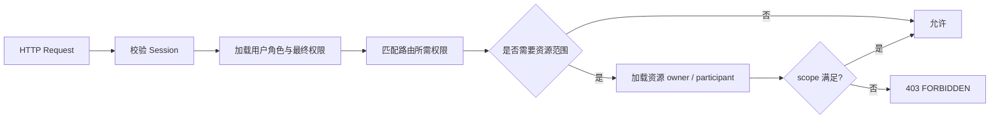
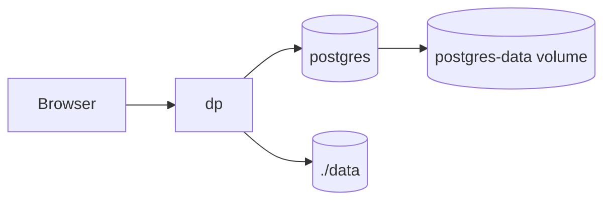

# DP RBAC 与 PostgreSQL 重构设计

> 文档状态：已批准，作为本轮重构的实现基线
> 关联文档：[PRD](./prd.md) · [架构设计](./architecture.md)
> 更新时间：2026-09-02

## 1. 背景与目标

当前 DP 使用 `admin/user` 二值角色，并在 HTTP Handler 中混合角色判断和 `owner_id` 校验；SQLite、文件目录和单容器部署也限制了后续权限治理与并发能力。本轮进行不兼容重构：

- 建立可管理的 Core RBAC，实现用户、角色、权限和数据范围的统一授权；
- 将数据库完全替换为 PostgreSQL，不保留 SQLite 运行或数据迁移兼容代码；
- 使用 Docker Compose 同时部署 DP 与 PostgreSQL；
- 将授权从业务 Handler 中收口到统一的策略与资源范围检查；
- 保持模块化单体，不引入微服务、Redis、消息队列、策略 DSL 或外部 IAM；
- 按单一职责拆分 Go 包和数据访问代码，遵循 Uber Go Style Guide。

本次是干净重构。旧 SQLite 数据库、旧 migration 和旧 `users.role` 字段不提供自动迁移；需要保留的数据应在重构前另行导出，重构后的 DP 使用全新 PostgreSQL 数据库初始化。

## 2. 设计原则

1. **默认拒绝**：未获得明确权限的请求返回 `403 FORBIDDEN`。
2. **后端是授权真源**：前端权限只用于导航和按钮呈现，不能代替 API 校验。
3. **最小权限**：角色只授予完成职责所需权限；多角色权限取并集。
4. **权限与数据范围分离**：权限回答“能做什么”，`own/all` 回答“能操作谁的数据”。
5. **无显式拒绝**：没有 deny 规则，避免 allow/deny 优先级和策略冲突。
6. **立即生效**：每个认证请求从 PostgreSQL 获取当前角色与权限；角色或绑定修改后不依赖重新登录。
7. **防止权限提升**：角色和账号管理接口必须校验操作者是否有权授予目标权限。
8. **数据库约束兜底**：唯一性、引用关系、系统角色保护和关键状态尽量由事务与约束保证。

## 3. RBAC 模型

### 3.1 实施范围

采用 NIST Core RBAC：

- 用户分配角色（user assignment）；
- 角色分配权限（permission assignment）；
- 用户可拥有多个角色；
- 会话激活用户的全部有效角色；
- 支持查询用户角色、角色权限和用户最终权限。

本阶段不实现角色继承、静态/动态职责分离、条件表达式和临时角色激活。这些能力在当前团队规模没有明确需求，引入后会显著增加授权解释和测试复杂度。

### 3.2 核心对象

| 对象 | 说明 |
| --- | --- |
| User | 可登录账号，不再保存单一 `role` 字段 |
| Role | 一组职责稳定的权限，可为系统内置或自定义 |
| Permission | 固定权限目录中的 `resource.action`，由代码和数据库种子共同维护 |
| RolePermission | 角色与权限的绑定，同时记录 `own/all` 数据范围 |
| UserRole | 用户与角色的多对多绑定 |

权限目录固定，不允许用户创建任意权限键；角色允许自定义。这样可以提供完整的角色管理，同时保证每个权限都有对应的后端检查实现。

### 3.3 数据范围

每条角色权限绑定包含 `scope`：

- `own`：只允许访问账号本人拥有或参与的数据；
- `all`：允许访问全部账号的数据。

同一用户从多个角色获得同一权限时，`all` 覆盖 `own`。不适用账号归属的全局资源只接受 `all`。

资源范围定义：

| 资源 | `own` 判定 |
| --- | --- |
| package、environment、tag、model、service | `owner_id = current_user.id` |
| service config、service log | 通过 environment 的 `owner_id` |
| operation | `owner_id = current_user.id` 或 `actor_user_id = current_user.id` |
| communication | 当前用户是发起人、目标人或消息参与人 |
| session | `user_id = current_user.id` |
| account、role、audit、notification、dashboard | 全局资源，只允许 `all` |

### 3.4 权限目录

| 资源 | 权限键 | 允许范围 | 说明 |
| --- | --- | --- | --- |
| dashboard | `dashboard.read` | all | 查看管理总览 |
| account | `account.read` | all | 查看账号、详情和会话 |
| account | `account.create` | all | 创建账号 |
| account | `account.update` | all | 启停账号、重置密码、撤销会话 |
| account | `account.delete` | all | 删除账号 |
| account | `account.assign_roles` | all | 分配和移除用户角色 |
| account | `account.transfer` | all | 交接账号资源 |
| role | `role.read` | all | 查看角色、权限目录和绑定 |
| role | `role.create` | all | 创建自定义角色 |
| role | `role.update` | all | 修改角色及权限绑定 |
| role | `role.delete` | all | 删除未使用的自定义角色 |
| package | `package.read` | own/all | 查看安装包和版本 |
| package | `package.write` | own/all | 上传、更新、切换版本和备注 |
| package | `package.delete` | own/all | 删除版本或安装包 |
| environment | `environment.read` | own/all | 查看环境和 SSH 信息摘要 |
| environment | `environment.write` | own/all | 新建和修改环境 |
| environment | `environment.delete` | own/all | 删除环境 |
| environment | `environment.validate` | own/all | 执行 SSH 校验 |
| environment | `environment.import` | own/all | 导入环境 |
| environment | `environment.export` | own/all | 导出环境 |
| tag | `tag.read` | own/all | 查看资源标签 |
| tag | `tag.write` | own/all | 创建、修改、删除和绑定标签 |
| model | `model.read` | own/all | 查看模型及任务 |
| model | `model.upload` | own/all | 上传、续传、完成和重试模型 |
| model | `model.delete` | own/all | 删除模型或取消上传 |
| service | `service.read` | own/all | 查看服务状态 |
| service | `service.config.read` | own/all | 查看配置、模板和历史 |
| service | `service.config.write` | own/all | 保存和回滚配置 |
| service | `service.install` | own/all | 安装服务 |
| service | `service.start` | own/all | 启动服务 |
| service | `service.stop` | own/all | 停止服务 |
| service | `service.reset` | own/all | 重置安装状态 |
| service | `service.health` | own/all | 手动健康检查 |
| service | `service.log.read` | own/all | 查看推理或普通服务日志 |
| operation | `operation.read` | own/all | 查看操作、事件和历史日志 |
| audit | `audit.read` | all | 查看审计事件和统计 |
| audit | `audit.export` | all | 导出审计事件 |
| notification | `notification.read` | all | 查看风险通知 |
| notification | `notification.update` | all | 标记已读和确认处理 |
| communication | `communication.read` | own/all | 查看参与事项或全部事项 |
| communication | `communication.create` | all | 创建通讯事项 |
| communication | `communication.reply` | own/all | 发送消息和标记已读 |
| communication | `communication.manage` | all | 关闭或重新打开事项 |

登录、退出、查询本人、修改本人密码和管理本人其他会话属于认证自服务，不进入业务权限目录；仍须校验会话身份、同源和临时密码状态。

### 3.5 内置角色

| 角色 | 用途 | 默认授权 |
| --- | --- | --- |
| `super_admin` | 系统所有者 | 全部权限，范围均为 `all` |
| `platform_admin` | 平台日常管理 | 除修改系统角色、授予 `super_admin` 外的管理及业务权限，范围为 `all` |
| `operator` | 业务运维 | 自有安装包、环境、标签、模型、服务和操作的读写权限；通讯仅查看和回复本人事项 |
| `viewer` | 只读用户 | 自有业务资源、操作和通讯的只读权限 |

约束：

- 内置角色的标识、删除状态和权限基线不可由 API 修改；显示名称和描述也保持固定。
- 初始管理员固定绑定 `super_admin`。
- 系统至少保留一个启用且绑定 `super_admin` 的账号。
- 不能移除当前用户自己的最后一个 `super_admin` 绑定。
- 只有 `super_admin` 可以向其他账号授予或移除 `super_admin`。
- 只有 `super_admin` 可以重置、禁用、强制下线或删除持有 `super_admin` 的账号，避免普通账号管理权限被用于接管超级管理员身份。
- 被重新启用的账号必须已绑定至少一个角色；禁用账号可以暂时清空角色，以便完成离职或权限重建流程。
- 自定义角色不能获得操作者自身最终权限之外的权限或更大的数据范围。

### 3.6 授权流程



路由注册必须声明权限键，不能在 Handler 中散落 `user.Role == ...`。资源加载器只负责解析资源归属，不承担业务修改。列表接口根据最终 scope 自动收窄查询：`all` 可选择指定 `owner_id` 或全部，`own` 强制当前用户 ID。

已认证账号访问存在但超出自身 scope 的资源时统一返回 `403 FORBIDDEN`；只有资源本身不存在时返回
`404 NOT_FOUND`。授权层不得用 404 隐藏越权结果，否则前端无法区分资源失效与权限不足，也无法形成准确的
`authorization.denied` 审计。

认证登录、退出、当前账号密码和本人会话属于账号自助端点，仅要求有效会话；`GET /api/v1/events` 是已认证用户的事件传输通道，不独立授予数据读取能力，服务端只向订阅者投递其已有权限范围内产生的事件。除此之外的业务路由必须在注册处声明一个权限键。

### 3.7 角色管理 API

| 方法 | 路径 | 权限 |
| --- | --- | --- |
| GET | `/api/v1/permissions` | `role.read` |
| GET | `/api/v1/roles` | `role.read` |
| POST | `/api/v1/roles` | `role.create` |
| GET | `/api/v1/roles/{id}` | `role.read` |
| PUT | `/api/v1/roles/{id}` | `role.update` |
| DELETE | `/api/v1/roles/{id}` | `role.delete` |
| PUT | `/api/v1/users/{id}/roles` | `account.assign_roles` |

`POST /api/v1/users` 使用 `{"username":"...","password":"...","role_ids":["..."]}`，不再接受旧的单值 `role`。至少选择一个角色；服务端拒绝重复、未知或超出创建者自身可授予范围的角色。账号与全部角色绑定在同一 PostgreSQL 事务中创建，任一步骤失败都不留下无角色账号。

创建角色请求包含 `key`、`name`、`description` 和 `grants`；更新角色请求不允许修改稳定的
`key`，只包含 `name`、`description` 和完整的 `grants`。每个 grant 由
`permission` 与 `scope` 组成，保存采用全量替换语义。用户角色更新请求为
`{"role_ids":["..."]}`，同样采用全量替换语义；空数组不允许使启用账号失去全部角色。
服务端拒绝未知权限、重复 grant、不适用于 `own` 的全局权限、未知角色和重复角色 ID。

系统角色不能通过 API 修改或删除。自定义角色被用户占用时删除返回
`409 ROLE_IN_USE`；角色 key 冲突返回 `409 ROLE_KEY_CONFLICT`；尝试授予操作者自身没有的权限或
更大 scope 返回 `403 GRANT_FORBIDDEN`；修改系统角色、移除自己的 `super_admin`、让系统失去
最后一个启用的 `super_admin`，或由非 `super_admin` 授予/移除 `super_admin`，返回
`409 ROLE_PROTECTED`。角色和用户角色全量替换都在单个事务中完成，用户角色事务使用固定的
advisory lock 串行化超级管理员不变量检查。

禁用或删除账号也可能减少启用的 `super_admin`，因此必须与用户角色替换共用同一 advisory lock，并在
持有目标账号行锁时重新计算剩余启用超级管理员。检查与写入处于同一事务；无论角色移除、账号禁用还是账号
删除，都不能通过并发竞态绕过“至少一个启用 `super_admin`”约束。

`GET /api/v1/auth/me` 返回角色摘要和最终权限：

```json
{
  "id": "...",
  "username": "operator-a",
  "roles": [{"id": "...", "key": "operator", "name": "运维人员"}],
  "permissions": {"service.start": "own", "service.stop": "own"}
}
```

前端根据权限映射生成导航和操作入口；直接访问无权页面时显示 403 页面，不静默跳到其他页面。

用户、通讯和审计的公开 JSON 只使用多角色字段：用户返回 `roles` 与 `permissions`，通讯快照返回
`roles`/`sender_roles`，审计返回 `actor_roles`。本次不兼容重构不再输出或接收旧的单值
`role`、`sender_role`、`actor_role`，也不提供字段别名或数据转换入口。

同一原则适用于外围状态：环境导入只接受 schema v2，浏览器不读取旧模型上传 localStorage key，启动脚本
不补写旧 `.env`。缺少当前 PostgreSQL、管理员或主密钥字段时直接拒绝并要求重新初始化配置。

## 4. PostgreSQL 数据设计

### 4.1 技术选型

- PostgreSQL 17，Compose 使用 `postgres:17-alpine`；
- Go 使用 `github.com/jackc/pgx/v5/pgxpool`；
- 时间字段使用 `TIMESTAMPTZ`，布尔字段使用 `BOOLEAN`，结构化审计字段使用 `JSONB`；
- 主键继续由应用生成 UUID，并在 PostgreSQL 中使用 `UUID` 类型；
- SQL 参数使用 PostgreSQL `$1` 形式；
- 事务使用 `pgx.Tx`，所有查询继续传递 `context.Context`；
- 启动时执行内嵌 migration，并用 PostgreSQL advisory lock 防止并发迁移。

不为每个 DP 用户创建 PostgreSQL role。PostgreSQL 只接受 DP 服务账号连接；业务 RBAC 在应用层执行，避免把业务账号生命周期耦合到数据库登录角色。

### 4.2 RBAC 表

#### `users`

删除旧 `role` 字段。保留账号、密码、安全状态、创建人和时间字段。

#### `roles`

| 字段 | 类型 | 说明 |
| --- | --- | --- |
| `id` | UUID PK | 角色 ID |
| `key` | VARCHAR(63) UNIQUE | 稳定小写标识 |
| `name` | VARCHAR(64) | 显示名称 |
| `description` | VARCHAR(500) | 职责说明 |
| `system` | BOOLEAN | 是否内置角色 |
| `created_by` | UUID FK NULL | 创建人 |
| `created_at` | TIMESTAMPTZ | 创建时间 |
| `updated_at` | TIMESTAMPTZ | 更新时间 |

#### `permissions`

| 字段 | 类型 | 说明 |
| --- | --- | --- |
| `id` | UUID PK | 权限 ID |
| `key` | VARCHAR(127) UNIQUE | 稳定权限键 |
| `resource` | VARCHAR(63) | 资源类别 |
| `action` | VARCHAR(63) | 操作 |
| `description` | VARCHAR(255) | 中文说明 |
| `scoped` | BOOLEAN | 是否允许 `own/all`；否则只能 all |

#### `role_permissions`

| 字段 | 类型 | 说明 |
| --- | --- | --- |
| `role_id` | UUID FK | 角色 |
| `permission_id` | UUID FK | 权限 |
| `scope` | VARCHAR(8) | `own` 或 `all` |

主键为 `(role_id, permission_id)`，`scope` 使用 CHECK 约束。

#### `user_roles`

| 字段 | 类型 | 说明 |
| --- | --- | --- |
| `user_id` | UUID FK | 用户 |
| `role_id` | UUID FK | 角色 |
| `assigned_by` | UUID FK | 分配人 |
| `assigned_at` | TIMESTAMPTZ | 分配时间 |

主键为 `(user_id, role_id)`。删除自定义角色前必须确认没有用户绑定；不使用级联删除隐藏关系变化。

### 4.3 业务表约束

- 业务资源 `owner_id` 使用 UUID 外键并建立索引；
- 软删除表的业务唯一性使用 partial unique index；
- 删除用户、角色或资源的行为由应用事务显式处理，审计快照不使用级联删除；
- 会话、一次性 Token 和限流时间全部使用 `TIMESTAMPTZ` 比较，不再保存格式化时间字符串；
- 审计目标、变更摘要和通知目标使用 `JSONB`；
- 列表游标继续使用 `(created_at, id)` 稳定排序；
- PostgreSQL 错误通过 SQLSTATE 映射为领域冲突、外键冲突和校验错误，不按错误文本判断。

### 4.4 Migration

- 删除现有 SQLite migration，新的 `001_initial.sql` 创建完整 PostgreSQL schema 和权限目录；
- migration 表记录版本、名称、校验和和执行时间；
- 每个 migration 在单独事务中执行，执行前获取固定 advisory lock；
- 已执行 migration 文件不得修改；后续变化新增递增版本；
- 启动发现同版本校验和不一致时拒绝启动；
- 不读取、不转换、不复制旧 `data/dp.db`。

## 5. Go 项目结构

```text
internal/
├── access/                    # 权限常量、Scope、授权决策
├── application/               # 用例编排与事务边界
├── domain/                    # 领域对象和错误
├── httpapi/                   # 路由、认证、权限声明、请求响应
├── repository/postgres/       # pgxpool、migration、按领域拆分的查询文件
├── security/                  # 密码、Cookie、加密和 Origin
├── archive/                   # 安装包检查与模板
├── remote/                    # SSH/SFTP
├── operation/                 # 服务操作调度
├── model/                     # 模型任务调度
├── audit/                     # 审计策略
├── health/                    # DP 与目标服务健康检查
└── realtime/                  # SSE
```

拆分规则：

- `httpapi` 不直接拼业务 SQL，不判断固定角色名；
- `access` 不依赖 HTTP 和 PostgreSQL，只处理权限、scope 和资源归属；
- `repository/postgres` 按 `auth.go`、`rbac.go`、`environment.go` 等领域文件拆分，不为每张表创建空洞仓储接口；
- 应用服务只为真实外部边界定义小接口，接口由消费方声明；
- 构造函数使用字段名初始化，错误只处理一次并使用 `%w` 添加简短上下文；
- 生产路径不 panic，不使用可变全局状态，不启动无法收敛的 fire-and-forget goroutine；
- `main` 只负责装配、生命周期和退出，复杂初始化下沉到独立函数。

## 6. Docker Compose 部署

Compose 包含两个服务：



- `postgres` 不发布宿主机端口，只加入 Compose 内部网络；
- PostgreSQL 使用 `pg_isready` 健康检查；
- `dp.depends_on.postgres.condition` 使用 `service_healthy`；
- DP 使用 `DP_DATABASE_URL` 连接，Compose 内默认 `sslmode=disable`；外部 PostgreSQL 生产连接应使用 `verify-full`；
- PostgreSQL 密码由 `dp.sh init` 生成并写入权限为 `0600` 的 `.env`；
- `./data` 只保存安装包、模型任务元数据文件和操作日志，不再保存数据库；
- PostgreSQL 使用独立持久卷；备份采用 `pg_dump`，恢复采用 `pg_restore/psql`；
- 部署脚本提供 `backup [目录]` 和 `restore <目录>`。备份目录包含自定义格式数据库转储、`data/`
  归档、`.env` 副本和校验文件；恢复仅允许在 DP/PostgreSQL 容器均已停止时执行，并在覆盖前要求
  操作者输入明确确认。恢复完成后启动 Compose，由应用执行当前版本 migration；不支持导入 SQLite；
- `/healthz` 同时检查 PostgreSQL 连通性，数据库不可用时返回 503；
- 离线部署包必须同时包含 DP 镜像和 PostgreSQL 镜像，启动脚本逐一 `docker image load`。

开发和生产均以 Compose 为标准启动方式。本地需要只运行 Go 进程时，开发者自行提供 `DP_DATABASE_URL` 指向可用 PostgreSQL。

## 7. 前端改造

- `AuthContext` 保存 `roles` 和 `permissions`，提供 `can(permission, scope?)`；
- 路由和菜单以权限声明过滤，不再判断 `user.role === 'admin'`；
- 新增“角色与权限”页面：角色列表、权限矩阵、角色成员和用户角色分配；
- 账号页面由权限决定可见操作；角色选择支持多选；
- 非 `super_admin` 查看超级管理员账号时，不显示重置密码、角色调整、禁用、强制下线和删除入口，角色选择器也不提供 `super_admin`；后端仍独立拒绝绕过前端的请求；
- 全账号数据范围筛选只在对应权限 scope 为 `all` 时出现；
- 无权操作不渲染，服务端返回 403 时仍展示明确提示；
- 权限矩阵按资源分组，单元格展示未授权、own、all，避免直接编辑权限键文本。

## 8. 审计与安全

新增审计动作：

- `role.create`、`role.update`、`role.delete`，其中 `role.update` 的变更快照包含完整权限绑定；
- `account.role.update`；
- 因权限不足被拒绝的高风险写请求记录 `authorization.denied`，快照保留原请求动作和权限键；同一用户和权限在 30 秒窗口内只记录一次，避免日志放大。

审计快照记录角色 key、权限 key、scope 和目标账号，不记录会话 Token、密码或完整请求体。角色变更和用户角色分配必须在同一数据库事务内保存业务数据；审计最终结果由现有统一审计链路记录。

## 9. 测试与验收

### 9.1 后端

- 权限目录与路由声明一一对应，业务 API 不允许缺少权限声明；
- 内置角色矩阵快照测试；
- 多角色并集、own/all 提升、默认拒绝测试；
- 所有资源类型的 own/all 越权测试；
- 自定义角色 CRUD、绑定、占用删除和防权限提升测试；
- 最后一个 `super_admin` 保护及并发事务测试；
- PostgreSQL migration 从空库执行、重复执行和校验和冲突测试；
- PostgreSQL 唯一约束、外键、软删除唯一索引和事务回滚测试；
- HTTP 401、403、404 边界测试，禁止用 404 掩盖已认证但无权操作；
- `go test -race ./...`、`go vet ./...` 通过。

### 9.2 前端

- 每个内置角色的菜单、路由和按钮可见性测试；
- own 与 all 数据范围选择器测试；
- 角色权限矩阵编辑和防误操作确认测试；
- API 返回 403 的页面反馈测试；
- TypeScript 类型检查、Vitest 和生产构建通过。

### 9.3 部署

- `docker compose up -d` 后 PostgreSQL 先健康，DP 再启动；
- 空库自动建表并初始化权限、内置角色和初始管理员；
- 重启两个容器后数据库、业务文件和 RBAC 绑定保持；
- PostgreSQL 停止时 DP `/healthz` 返回 503，恢复后自动恢复健康；
- 离线包在无网络环境成功加载两个镜像并启动；
- 完成 `pg_dump` 备份和恢复演练。

## 10. 实施顺序

1. 文档、权限目录和路由矩阵定稿；
2. 建立 PostgreSQL schema、migration runner 和 Compose；
3. 重写认证与 RBAC repository、应用服务和中间件；
4. 按资源域迁移 SQL 与授权检查；
5. 改造前端权限上下文、路由和角色管理页面；
6. 更新 OpenAPI、部署脚本和离线镜像打包；
7. 删除 SQLite、二值角色和兼容代码；
8. 执行全量测试、越权测试、备份恢复和离线部署验收。

任一步修改用户行为或接口前，必须先更新本文档、PRD 或架构文档，再修改代码。

## 11. 调研依据

- [NIST Role Based Access Control](https://csrc.nist.gov/Projects/role-based-access-control/faqs)：Core、Hierarchical 和 Constrained RBAC 的标准组成；本设计实施 Core RBAC。
- [NIST IR 6192](https://csrc.nist.gov/pubs/ir/6192/final)：通过组织角色中介用户对资源的访问。
- [PostgreSQL 17 Constraints](https://www.postgresql.org/docs/17/ddl-constraints.html)：主键、唯一约束、外键和引用列索引原则。
- [PostgreSQL 17 Explicit Locking](https://www.postgresql.org/docs/17/explicit-locking.html)：migration 使用事务级 advisory lock。
- [PostgreSQL 17 Connection Strings](https://www.postgresql.org/docs/17/libpq-connect.html)：连接 URI、`application_name` 和 SSL 参数。
- [Docker Compose startup order](https://docs.docker.com/compose/how-tos/startup-order/)：通过 healthcheck 和 `service_healthy` 控制启动顺序。
- [Go database access](https://go.dev/doc/database/)：连接池、事务和 Context 取消。
- [Uber Go Style Guide](https://github.com/uber-go/guide/blob/master/style.md)：错误处理、接口边界、初始化、命名和并发约定。
